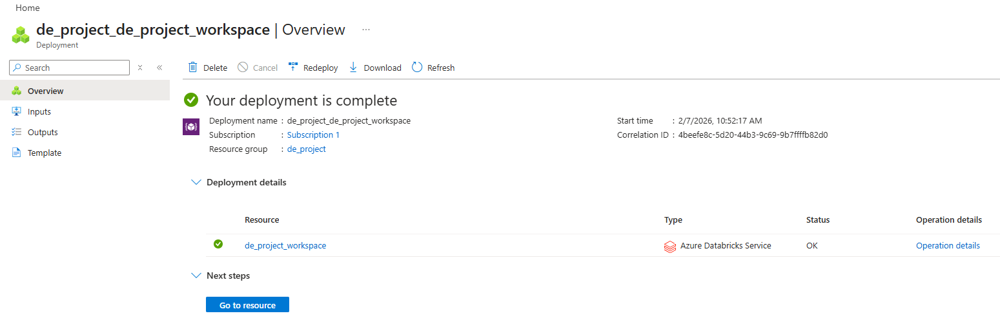
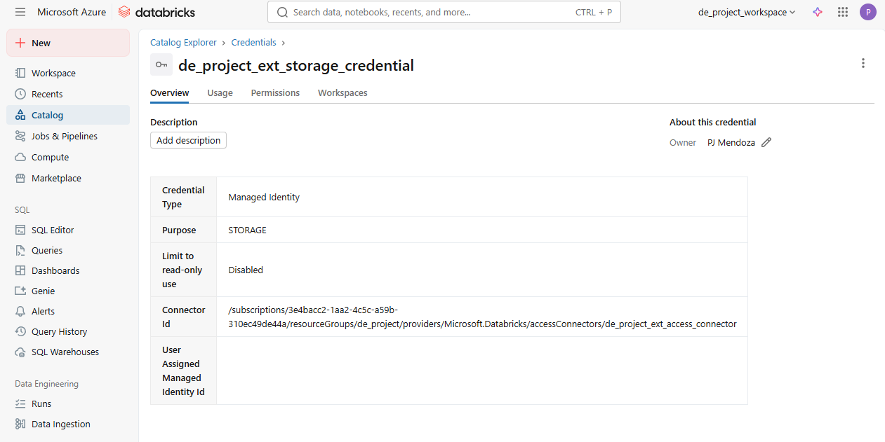
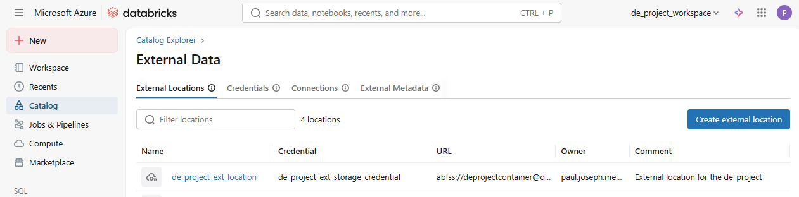
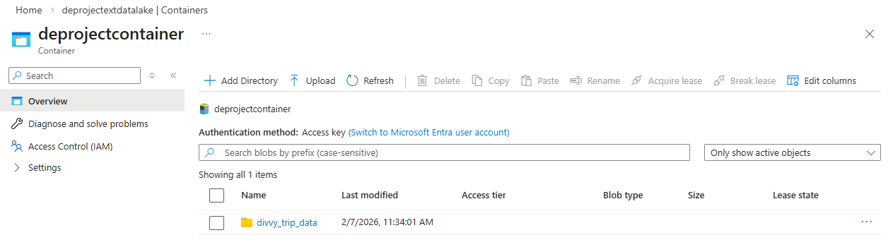

# Medallion Architecture on Databricks: A Cyclistic Case Study

## Introduction

Welcome to the **Medallion Architecture on Databricks: A Cyclistic Case Study**! In this project, we will explore how to implement the Medallion Architecture on Azure Databricks, with a focus on the Cyclistic bike share dataset.

This project will cover the following key areas:
- Understand the business requirements
- Explore the Cyclistic dataset
- Build the Azure Databricks infrastructure
- Build the Catalog & Schemas
- Build the Landing, Bronze, Silver, and Gold layers
- Perform data analytics and derive insights


## Understand the Business Requirements

The director of marketing team believes Cyclistic's future success depends on maximizing the number of annual memberships. Therefore, your team wants to understand how casual riders and annual members use Cyclistic bikes differently. 

From these insights, your team will design a new marketing strategy to convert casual riders into annual members. But first, Cyclistic executives must approve your recommendations, so they must be backed up with compelling data insights and professional data visualizations. 

Determine how MEMBERS and CASUAL users use Cyclistic bikes differently. Specifically:
1. Analyze the data and identify trends and patterns,
2. Create visualizations, and
3. Provide key findings and recommendations. 

Let's ask the **SMART** questions.

* **Specific**. Which bike type is the most preferred by MEMBERS and CASUAL users?
* **Measurable**. What percentage of the total rides is made by the MEMBERS?
* **Action-oriented**. How can we convince the CASUAL users to join the annual membership?
* **Relevant**. What programs can we launch to attract more users to ride bikes?
* **Time-bound**. What trends can we observe from different short-term time periods?


## Explore the Cyclistic Dataset

Cyclistic’s datasets can be downloaded [here](https://divvy-tripdata.s3.amazonaws.com/index.html). This case study covers the 2025 data available in the repository. The files are first-party datasets owned, prepared and shared by Cyclistic with file naming format ‘YYYYMM-divvy-tripdata.csv’.

Let's be reminded that Cyclistic is a fictional company that represents a real-world organization. Its datasets are prepared to maintain anonymity. The data has been made available by Motivate International Inc. under this [license](https://divvybikes.com/data-license-agreement).


## Build the Azure Databricks Infrastructure

To build the infrastructure for this project, we will need to set up the following components in Azure:

* A **Databricks Workspace** to run our data processing and analytics workloads.
* An **Access Connector** to securely connect our Databricks workspace to our storage account.
* A **Storage Account** to store our raw and processed data.
* A **Container** in the storage account to organize our data.

In Databricks, we will set up the following components:
* A **Storage Credential** in Databricks to access the storage account.
* An **External Location** in Databricks to reference the container in our storage account.

<details>
<summary>Step 1: Create the Databricks Workspace</summary>



</details>

<details>
<summary>Step 2: Create an Access Connector</summary>


</details>

<details>
<summary>Step 3: Create the Storage Account</summary>


</details>

<details>
<summary>Step 4: Enable Access to the Storage Account</summary>


</details>

<details>
<summary>Step 5: Create A Storage Credential in Databricks</summary>



</details>

<details>
<summary>Step 6: Create A Container</summary>


</details>

<details>
<summary>Step 7: Create An External Location</summary>



</details>

<details>
<summary>Step 8: Upload the Datasets</summary>



</details>


## Build the Catalog & Schemas

### Create the Catalog cyclistic

```sql
CREATE CATALOG IF NOT EXISTS cyclistic 
MANAGED LOCATION 'abfss://deprojectcontainer@deprojectextdatalake.dfs.core.windows.net/'
COMMENT 'Catalog for Cyclistic/Divvy';
```

Let's verify the catalog we just created.

```sql
DESCRIBE CATALOG EXTENDED cyclistic;
```

### Create the Schemas

Following the Medallion Architecture, we will create four schemas: `landing`, `bronze`, `silver`, and `gold`.

If you want to learn more about the Medallion Architecture, check out this [blog post](https://www.datawithbaraa.com/post/medallion-architecture-on-databricks).

```sql
USE CATALOG cyclistic;

CREATE SCHEMA IF NOT EXISTS landing COMMENT 'Raw CSV files';
CREATE SCHEMA IF NOT EXISTS bronze COMMENT 'Raw ingested (lossless)';
CREATE SCHEMA IF NOT EXISTS silver COMMENT 'Cleansed & conformed';
CREATE SCHEMA IF NOT EXISTS gold   COMMENT 'Modeled analytics (facts/aggregations)';
```

## Build the Landing Layer

The Landing layer is where we will store the raw data files as they are ingested from the external source. Here we will create an external volume that points to the location of the raw data files in our Azure Storage Account.

**Note**: In a production environment, you would typically use a more secure method to manage access to your storage account, such as using **Azure Managed Identities** or **Databricks Secrets**. 

### Create DDL for External Volume

```sql
USE CATALOG cyclistic;
USE SCHEMA landing;

-- Create an external volume for raw data
CREATE EXTERNAL VOLUME IF NOT EXISTS divvy_trip_data
LOCATION 'abfss://deprojectcontainer@deprojectextdatalake.dfs.core.windows.net/divvy_trip_data/'
COMMENT 'External volume for raw data';
```

### Verify the External Volume

```sql
DESCRIBE EXTERNAL VOLUME cyclistic.landing.divvy_trip_data;
```

### Retrieve the VOLUME_PATH for the Bronze Layer Ingestion Script

```sql
SELECT VOLUME_PATH FROM SYSTEM.VOLUMES WHERE VOLUME_NAME = 'divvy_trip_data';
```

## Build the Bronze Layer

The Bronze layer is where we will store the raw ingested data in a Delta table format. This layer serves as the foundation for further data processing and cleansing.

We wll also add ingestion metadata columns to track the source file and ingestion timestamp.

**Note**: In a production environment, you would typically implement more robust data validation and error handling mechanisms during the ingestion process.


### Analyze the Dataset

<details>
<summary><h3>Quick Overview of the Dataset</h3></summary>

**Sample File:** `202501-divvy-tripdata.csv`

**Shape & Structure**

*   **Rows × Columns:** **138,689 × 13**. Columns: `ride_id`, `rideable_type`, `started_at`, `ended_at`, `start_station_name`, `start_station_id`, `end_station_name`, `end_station_id`, `start_lat`, `start_lng`, `end_lat`, `end_lng`, `member_casual`. 

**Data Types**

*   `ride_id`, `rideable_type`, `start_station_name`, `start_station_id`, `end_station_name`, `end_station_id`, `member_casual` → string
*   `started_at`, `ended_at` → timestamp
*   `start_lat`, `start_lng`, `end_lat`, `end_lng` → double 

**Data Quality Highlights**

*   **Duplicate `ride_id`:** 0. 
*   **Nulls:** `start_station_*` missing **22,852** rows; `end_station_*` missing **24,073** rows; `end_lat/end_lng` missing **61** rows. 
*   **Durations:** computed duration\_secs > 0 for all; **0** negative or zero durations in this sample. 
*   **Geo validation:** **61** rows have out‑of‑range/missing lat/lng on at least one end. 
*   **Self‑loops:** \~**2,704** same station id; \~**5,275** same coordinates. Useful for QA or business rules. 
*   **Haversine distance (km):** median \~**1.29 km**, 90th **3.65 km**, 99th **7.90 km**, max **32.83 km**; >50 km **0** rows. 
*   **Member mix:** **114,536** member (82.6%) vs **24,153** casual (17.4%). 
*   **Rideable types:** **89,071** electric vs **49,618** classic. 
*   **Temporal:** peaks around **16:00–18:00**; midweek busier; **53** trips start in Dec 2024 (cross‑month edge case). 
*   **Top stations (sample):** “Kingsbury St & Kinzie St”, “Canal St & Madison St”, “Clinton St & Washington Blvd” rank high for start/end. 

</details>


### Create DDL for the *trips_raw* Table

The DDL below creates the Bronze Delta table `trips_raw` with ingestion metadata columns. DDL stands for **Data Definition Language**, which is used to define and manage database structures.

```sql
USE CATALOG cyclistic;
USE SCHEMA bronze;

CREATE TABLE IF NOT EXISTS trips_raw (
  ride_id            STRING,
  rideable_type      STRING,
  started_at         TIMESTAMP,
  ended_at           TIMESTAMP,
  start_station_name STRING,
  start_station_id   STRING,
  end_station_name   STRING,
  end_station_id     STRING,
  start_lat          DOUBLE,
  start_lng          DOUBLE,
  end_lat            DOUBLE,
  end_lng            DOUBLE,
  member_casual      STRING,
  _ingest_file       STRING,
  _ingest_ts         TIMESTAMP
)
```


### Develop SQL Load Script

Here we will load the raw CSV files into the Bronze Delta table using the `COPY INTO` command. This command is efficient and handles schema evolution. The COPY INTO command is **idempotent**, meaning it can be run multiple times without duplicating data, as it tracks which files have already been loaded.

Note: Adjust the file path in the `FROM` clause to match the location of your raw data files.

```sql
COPY INTO trips_raw
FROM (
  SELECT
    ride_id,
    rideable_type,
    to_timestamp(started_at)  AS started_at,
    to_timestamp(ended_at)    AS ended_at,
    start_station_name,
    start_station_id,
    end_station_name,
    end_station_id,
    CAST(start_lat AS DOUBLE) AS start_lat,
    CAST(start_lng AS DOUBLE) AS start_lng,
    CAST(end_lat   AS DOUBLE) AS end_lat,
    CAST(end_lng   AS DOUBLE) AS end_lng,
    member_casual,
    _metadata.file_name       AS _ingest_file,
    current_timestamp()       AS _ingest_ts
  FROM '/Volumes/cyclistic/landing/divvy_trip_data'
)
FILEFORMAT = CSV
FORMAT_OPTIONS ('header' = 'true', 'multiLine'='false')
COPY_OPTIONS ('mergeSchema'='true');  -- safe for extra cols in future
```

## Build the Silver Layer

The Silver layer is where we will store the cleansed and conformed data. This layer is optimized for analytics and reporting.

### Explore & Understand The Data

Here are some key data quality checks and transformations we will perform in the Silver layer:
*   **Null Handling**: Remove records with null `started_at` or `ended_at`.
*   **Duration Calculation**: Calculate trip duration in seconds and minutes; remove records with non-positive durations.
*   **Geographical Validation**: Ensure latitude and longitude values are within valid ranges.
*   **Distance Calculation**: Compute Haversine distance between start and end coordinates.
*   **Self-loop Detection**: Identify trips that start and end at the same station or coordinates.


### Create DDL for the *trips_clean* Table

```sql
USE CATALOG cyclistic;
USE SCHEMA silver;

CREATE TABLE IF NOT EXISTS trips_clean
(
  ride_id            STRING NOT NULL,
  rideable_type      STRING NOT NULL,
  started_at         TIMESTAMP NOT NULL,
  ended_at           TIMESTAMP NOT NULL,
  ride_date          DATE NOT NULL,
  ride_hour          TINYINT NOT NULL,
  duration_sec       INT NOT NULL,
  duration_min       DECIMAL(9,2) NOT NULL,
  start_station_id   STRING,
  start_station_name STRING,
  end_station_id     STRING,
  end_station_name   STRING,
  start_lat          DOUBLE NOT NULL,
  start_lng          DOUBLE NOT NULL,
  end_lat            DOUBLE NOT NULL,
  end_lng            DOUBLE NOT NULL,
  distance_km        DECIMAL(9,3) NOT NULL,
  is_self_loop       BOOLEAN NOT NULL,
  member_casual      STRING NOT NULL,
  _src_file          STRING NOT NULL,
  _load_date         DATE NOT NULL
)
USING DELTA
PARTITIONED BY (_load_date)
TBLPROPERTIES (
  'delta.autoOptimize.optimizeWrite'='true',
  'delta.autoOptimize.autoCompact'='true'
);
```

### Create the Haversine Function

The Haversine formula calculates the distance between two points on the surface of a sphere given their latitude and longitude. This function will be used to compute the distance between the start and end locations of each trip.

If the Haversine formula returned 0, it would imply that the two points are identical, meaning the trip started and ended at the same location - a self-loop.

To know more about the Haversine formula, you can check out this [Wikipedia article](https://en.wikipedia.org/wiki/Haversine_formula).

```sql
USE CATALOG cyclistic;
USE SCHEMA silver;

CREATE OR REPLACE FUNCTION silver.haversine_km(
  lat1 DOUBLE, lon1 DOUBLE, lat2 DOUBLE, lon2 DOUBLE
) RETURNS DOUBLE
RETURN 2*6371*asin(sqrt(
  pow(sin(radians(lat2-lat1)/2),2) +
  cos(radians(lat1))*cos(radians(lat2))*pow(sin(radians(lon2-lon1)/2),2)
));
```

### Cleanse, Transform and Load Data

The Transform process is probably the most exciting part of this project. It is where we apply the data quality checks and transformations to cleanse the data.

We begin by selecting data from the Bronze layer (`trips_raw`) and applying the necessary transformations and filters to create a clean and conformed dataset in the Silver layer (`trips_clean`). Then, we use the `MERGE INTO` statement to perform an upsert operation, ensuring that our Silver layer is always up-to-date and consistent with the latest data from the Bronze layer.

The `MERGE INTO` statement is used to perform an **upsert** operation, which means it will **update** existing records in the `trips_clean` table if they already exist based on `ride_id`, or **insert** new records if they do not exist yet.

The SQL code below has several key components:
*   **Source Selection**: Select data from the Bronze layer (`trips_raw`).
*   **Data Quality Filters**: Apply filters in the `WHERE` clause to remove records with null values, non-positive durations, and out-of-range geographical coordinates.
*   **Derived Columns**: Calculate new columns such as `ride_date`, `ride_hour`, `duration_sec`, `duration_min`, `distance_km`, and `is_self_loop`.

```sql
MERGE INTO trips_clean tc
USING 
(
  SELECT
    br.ride_id,
    br.rideable_type,
    br.started_at,
    br.ended_at,
    DATE(br.started_at) AS ride_date,
    HOUR(br.started_at) AS ride_hour,
    CAST((unix_timestamp(br.ended_at)-unix_timestamp(br.started_at)) AS INT) AS duration_sec,
    ROUND((unix_timestamp(br.ended_at)-unix_timestamp(br.started_at))/60.0,2) AS duration_min,
    br.start_station_id,
    br.start_station_name,
    br.end_station_id,
    br.end_station_name,
    br.start_lat, br.start_lng, br.end_lat, br.end_lng,
    CAST(silver.haversine_km(br.start_lat, br.start_lng, br.end_lat, br.end_lng) AS DECIMAL(9,3)) AS distance_km,
    (br.start_station_id <=> br.end_station_id 
     OR (round(br.start_lat,6) <=> round(br.end_lat,6) AND round(br.start_lng,6) <=> round(br.end_lng,6))) AS is_self_loop,
    br.member_casual,
    br._ingest_file AS _src_file,
    DATE(br._ingest_ts) AS _load_date
  FROM cyclistic.bronze.trips_raw br
  WHERE br.started_at IS NOT NULL
    AND br.ended_at   IS NOT NULL
    AND br.ended_at   >  br.started_at
    AND br.start_lat BETWEEN -90 AND 90
    AND br.end_lat   BETWEEN -90 AND 90
    AND br.start_lng BETWEEN -180 AND 180
    AND br.end_lng   BETWEEN -180 AND 180
) tr
ON tc.ride_id   = tr.ride_id
WHEN MATCHED THEN UPDATE SET *
WHEN NOT MATCHED THEN INSERT *;
```

Add Silver-level data quality constraints (fail-fast or informative). This is a simple way to enforce data quality rules at the table level. The `TBLPROPERTIES` can be used to document the quality checks that are applied to the data in the Silver layer. This can serve as a reference for data engineers and analysts who work with the data, and it can also be used by automated data quality monitoring tools.

```sql
ALTER TABLE trips_clean SET TBLPROPERTIES (
  'quality.duration_pos' = 'ended_at > started_at',
  'quality.geo_valid'    = 'lat/lng within range'
);
```

Optional performance tuning using `ZORDER`. The `OPTIMIZE` command reorganizes the data in the table to improve query performance. `ZORDER` is a technique that optimizes the layout of data on disk to improve query performance, especially for queries that filter on specific columns. By ZORDERing the `trips_clean` table by `ride_date`, `member_casual`, and `start_station_id`, we can significantly speed up queries that filter on these columns, which are common in our use case. 

```sql
OPTIMIZE trips_clean ZORDER BY (ride_date, member_casual, start_station_id);
```

## Build Gold Layer

```sql
USE CATALOG cyclistic;
USE SCHEMA gold;
```

### Create the Fact and Dimension Tables

```sql
-- Dimensions: List of Stations
CREATE OR REPLACE TABLE dim_station AS
SELECT DISTINCT
  COALESCE(start_station_id, end_station_id) AS station_id,
  COALESCE(start_station_name, end_station_name) AS station_name
FROM cyclistic.silver.trips_clean
WHERE COALESCE(start_station_id, end_station_id) IS NOT NULL;
```

```sql
-- Fact (can be kept narrow; we already have Silver with clean columns)
CREATE TABLE IF NOT EXISTS fact_trips
USING DELTA
PARTITIONED BY (ride_date)
AS
SELECT
  ride_id, ride_date, ride_hour,
  member_casual, rideable_type,
  start_station_id, end_station_id,
  duration_sec, duration_min, distance_km, is_self_loop
FROM cyclistic.silver.trips_clean;

-- Perf tune
OPTIMIZE fact_trips ZORDER BY (member_casual, rideable_type);
```


### Create the KPIs and Metrics

```sql
-- Aggregates
CREATE OR REPLACE TABLE daily_kpis AS
SELECT
  ride_date,
  member_casual,
  rideable_type,
  COUNT(*)                      AS trips,
  ROUND(AVG(duration_min),2)    AS avg_duration_min,
  ROUND(AVG(distance_km),3)     AS avg_distance_km
FROM cyclistic.silver.trips_clean
GROUP BY ride_date, member_casual, rideable_type;

CREATE OR REPLACE TABLE station_hourly AS
SELECT
  ride_date,
  ride_hour,
  start_station_id,
  COUNT(*) AS departures
FROM cyclistic.silver.trips_clean
GROUP BY ride_date, ride_hour, start_station_id;

-- Perf tune
OPTIMIZE daily_kpis ZORDER BY (ride_date);
```

## Wrap Up


## 🌟 About Me

Hi there! I'm **Paul Joseph Mendoza**. I’m an IT professional and passionate YouTuber on a mission to share knowledge and make working with data enjoyable and engaging!

Let's stay in touch! Feel free to connect with me on the following platforms:

[![LinkedIn]](https://www.linkedin.com/in/paul-joseph-mendoza/)
[![Website]](https://www.datawithbaraa.com)