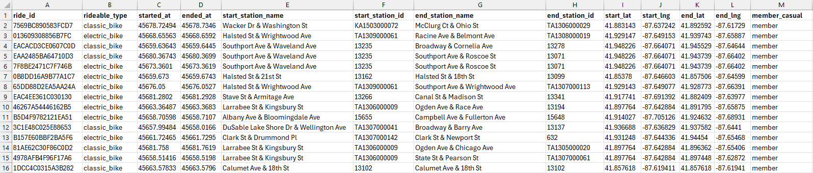

# Data Engineering with Databricks: A Cyclistic Case Study

## 🧭 Introduction

Welcome to the **Data Engineering with Databricks: A Cyclistic Case Study**! In this project, we will explore how to implement the Medallion Architecture on Azure Databricks, with a focus on the Cyclistic bike-share dataset.

This project will cover the following key areas:
- Understand the business requirements
- Explore the Cyclistic dataset
- Build the Azure Databricks infrastructure
- Build the Catalog & Schemas
- Build the Landing, Bronze, Silver, and Gold layers
- Perform exploratory data analytics and derive insights

## 🚨 Disclosure: Use of AI Tools

```
I integrated Github Copilot, Databricks Genie, and ChatGPT in this project to assist me in writing code and documentation. However, I made sure to review and understand all the code generated by these AI tools, and I only included materials that I fully comprehend and can explain. I also added my own research and explanations to the code to ensure that it is clear and understandable for anyone who reads it.

Thank you and enjoy!
```


## 📝 Understand the Business Requirements

The director of marketing team believes Cyclistic's future success depends on maximizing the number of annual memberships. Therefore, your team wants to understand how casual riders and annual members use Cyclistic bikes differently. From these insights, the Marketing team will design a new marketing strategy to convert casual riders into members.

As the Data Engineer, your task is to prepare the data for analysis and help the marketing team answer the following question:

Determine how MEMBERS and CASUAL users use Cyclistic bikes differently. Specifically:
1. Analyze the data and identify trends and patterns,
2. Create visualizations, and
3. Provide key findings and recommendations.

Let's ask the **SMART** questions.

* **Specific**. Which bike type is the most preferred by MEMBERS and CASUAL users?
* **Measurable**. What percentage of the total rides is made by the MEMBERS?
* **Action-oriented**. How can we convince the CASUAL users to join the annual membership?
* **Relevant**. What programs can we launch to attract more users to ride bikes?
* **Time-bound**. What trends can we observe from different short-term time periods?

You are given access to the Cyclistic dataset for 2025. Let's explore the dataset.


## 🔍 Explore the Cyclistic Dataset

Cyclistic’s datasets can be downloaded [here](https://divvy-tripdata.s3.amazonaws.com/index.html). This case study covers the 2025 data available in the repository. The files are first-party datasets owned, prepared and shared by Cyclistic with file naming format ‘YYYYMM-divvy-tripdata.csv’.

Please be reminded that Cyclistic is a fictional company that represents a real-world organization. Its datasets are prepared to maintain anonymity. The data has been made available by Motivate International Inc. under this [license](https://divvybikes.com/data-license-agreement).

<details>
<summary>👉 Here's a quick look of the January 2025 dataset</summary>


**Sample File** : `202501-divvy-tripdata.csv`



**Shape & Structure**

* **Rows × Columns** : 138,689 × 13
* **Columns** : `ride_id`, `rideable_type`, `started_at`, `ended_at`, `start_station_name`, `start_station_id`, `end_station_name`, `end_station_id`, `start_lat`, `start_lng`, `end_lat`, `end_lng`, `member_casual`

**Data Types**

* **STRING** : `ride_id`, `rideable_type`, `start_station_name`, `start_station_id`, `end_station_name`, `end_station_id`, `member_casual`
* **TIMESTAMP** : `started_at`, `ended_at`
* **DOUBLE** : `start_lat`, `start_lng`, `end_lat`, `end_lng`

</details>


## 🛠️ Build the Azure Databricks Infrastructure

Before we can start building on Databricks and performing analysis, we need to set up the infrastructure in Azure. This involves creating a Databricks workspace, setting up an access connector to securely connect to our storage account, and configuring the storage resources to store our data.

To build the infrastructure for this project, we will need to set up the following components in Azure:

* A **Databricks Workspace** to run our data processing and analytics workloads.
* An **Access Connector** to securely connect our Databricks workspace to our storage account.
* A **Storage Account** to store our raw and processed data.
* A **Container** in the storage account to organize our data.

In Databricks' side, we will set up the following components:

* A **Storage Credential** to access the storage account.
* An **External Location** to reference the container in our storage account.

Check out the documentation here 👉 [Build the Azure Databricks Infrastructure](docs/1_build_the_infrastructure.md)


## 🗂️ Build the Catalog & Schemas

We begin the project by creating a Catalog and Schemas in Databricks. The Catalog is a logical container for databases, and the Schemas are logical containers for tables. This structure allows us to organize our data according to the **Medallion Architecture**, which consists of the Bronze, Silver, and Gold layers.

Check out the documentation here 👉 [Build the Catalog & Schemas](docs/2_build_the_catalog_schemas.md)

## 🏗️ Build the Landing, Bronze, Silver & Gold Layers

The Medallion Architecture is a data design pattern that organizes data into different layers based on its level of refinement and quality. The layers are typically named Landing, Bronze, Silver, and Gold. Each layer serves a specific purpose in the data processing pipeline, allowing for better organization, governance, and scalability of data.

In this project, we will build each layer of the Medallion Architecture on Azure Databricks, starting with the Landing layer where we will store the raw data files, followed by the Bronze layer for raw ingested data, the Silver layer for cleansed and conformed data, and finally the Gold layer for analytics and reporting.

Check out the documentation here 👉 [Build the Landing, Bronze, Silver & Gold Layers](docs/3_build_the_layers.md)

## 📊 Exploratory Data Analysis & Visualization


Check out the documentation here 👉 [Exploratory Data Analysis & Visualization](docs/4_eda_viz.md)

## 🚀 Wrap Up


## 📚 References


## 👨‍💻 About Me

Hello! 

I'm **Paul Joseph Mendoza**, a junior data engineer with a love for building new stuff and uncovering the stories hidden within data. As a career shifter, I transitioned into data engineering after discovering my passion for working with data and solving complex problems. I have a strong proficiency in SQL, Python, Excel, Power BI, and cloud platforms like Azure and AWS. I'm always eager to learn new technologies and build data engineering projects. 

When I'm not working on data projects, I spend my time reading (I'm into Stephen King books right now), or walking around Cebu City with my wife, or just napping (Yeah, this is the best). 

Let's stay in touch! Feel free to connect with me on LinkedIn or check out my GitHub profile for more projects coming soooon.

[GitHub](https://github.com/nice1-pjcmendoza)

[LinkedIn](https://www.linkedin.com/in/paul-joseph-mendoza/)

 


