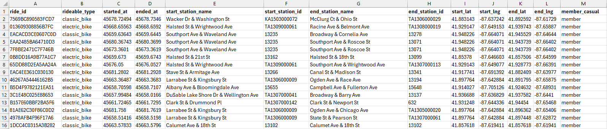

# Data Engineering with Azure Databricks: A Cyclistic Bike-Share Project

`Azure Databricks` ● `Data Engineering` ● `Medallion Architecture` ● `PySpark` ● `Batch Pipeline` ● `Exploratory Data Analysis` ● `Visualization` ● `Databricks Genie` ● `AI Agent`

## 🧭 Introduction

Welcome to the **Data Engineering with Azure Databricks: A Cyclistic Bike-Share Project**! In this project, we will build a batch pipeline using Azure Databricks to process and analyze the Cyclistic bike-share dataset. The goal of this project is to demonstrate how to implement the Medallion Architecture on Azure Databricks, which is a data design pattern that organizes data into different layers based on its level of refinement and quality.

This project will cover the following key areas:
- Understand the business requirements
- Explore the Cyclistic dataset
- Build the Azure Databricks infrastructure
- Build the Catalog & Schemas
- Build the Landing, Bronze, Silver, and Gold layers
- Perform exploratory data analytics and derive insights

## 🚨 Disclosure: Use of AI Agents

> I integrated 🤖 `Github Copilot`, 🤖 `Databricks Genie`, and 🤖 `ChatGPT` into this project to assist me in writing codes, analyzing data, and documenting my work. However, I made sure to review and understand all the codes generated by these AI tools, and I only included materials that I fully understand and can explain. I also added my own research and explanations to the code to ensure that it is clear and understandable for anyone who reads it. Thank you and enjoy!

## 📝 Understand the Business Requirements

The manager of Marketing department believes Cyclistic's future success depends on maximizing the number of annual memberships. Therefore, the team wants to understand how casual users and annual members use Cyclistic bikes differently. From these insights, Marketing will design a new strategy to convert casual users into members.

As the Data Engineer, your task is to primarily prepare the data for analysis and, as secondary, help the Marketing department find insights that will assist them in designing a new marketing strategy. 

Specifically, you will need to:
1. Setup an Azure-based storage solution to store the raw data files.
2. Build a batch ingestion pipeline to extract and transform the Cyclistic dataset from source.
3. Create Hourly and Daily aggregations to analyze the usage patterns and activities.
4. Analyze the data and identify trends and patterns.

You are given access to the 2025 Cyclistic dataset and an Azure account where you will build your project. You are also given unlimited access to coffee in the pantry. ☕︎

Let's explore the dataset.

## 🔍 Explore the Cyclistic Dataset

The Cyclistic datasets can be downloaded [here](https://divvy-tripdata.s3.amazonaws.com/index.html). The files are first-party datasets owned, prepared and shared by Cyclistic with file naming format ‘YYYYMM-divvy-tripdata.csv’.

Please be reminded that Cyclistic is a fictional company that represents a real-world organization. Its datasets are prepared to maintain anonymity. The data has been made available by Motivate International Inc. under this [license](https://divvybikes.com/data-license-agreement).

Each CSV file contains rows of unique ride IDs, the type of bike used, timestamps, station names, geographic coordinates, and whether the user is a member or a casual rider.

👉 Here's a quick look of the January 2025 dataset

---

**Sample File** : `202501-divvy-tripdata.csv`

**Shape & Structure**

* **Rows × Columns** : 138,689 × 13
* **Columns** : `ride_id`, `rideable_type`, `started_at`, `ended_at`, `start_station_name`, `start_station_id`, `end_station_name`, `end_station_id`, `start_lat`, `start_lng`, `end_lat`, `end_lng`, `member_casual`

**Data Types (as inferred)**

* **STRING** : `ride_id`, `rideable_type`, `start_station_name`, `start_station_id`, `end_station_name`, `end_station_id`, `member_casual`
* **TIMESTAMP** : `started_at`, `ended_at`
* **DOUBLE** : `start_lat`, `start_lng`, `end_lat`, `end_lng`

---

The dataset we received is in a raw format and contains some inconsistencies and missing values. Therefore, we need to clean and conform the data to ensure that it is accurate and consistent. This process will involve handling missing values, correcting data types, and standardizing the format of the data.

## 🛠️ Build the Azure Databricks Infrastructure

Before we can start building on Databricks and performing analysis, we need to set up the infrastructure in Azure. This involves creating a Databricks workspace, setting up an access connector to securely connect to our storage account, and configuring the storage resources to store our data.

To build the infrastructure for this project, we will need to set up the following components in Azure:

* A **Databricks Workspace** to run our data processing and analytics workloads.
* An **Access Connector** to securely connect our Databricks workspace to our storage account.
* A **Storage Account** to store our raw and processed data.
* A **Container** in the storage account to store raw data.

In Databricks' side, we will set up the following components:

* A **Storage Credential** to access the storage account.
* An **External Location** to reference the container in our storage account.

Check out the documentation here 👉 [Build the Azure Databricks Infrastructure](docs/1_build_the_infrastructure.md)

## 🗂️ Build the Catalog & Schemas

Now that we have our infrastructure set up, we can start building the Catalog and Schemas in Databricks. The Catalog is a logical container for databases, and the Schemas are logical containers for tables. This structure allows us to organize our data according to the **Medallion Architecture**, which consists of the Bronze, Silver, and Gold layers.

In this section, we will create a Catalog named `cyclistic` and four Schemas named `landing`, `bronze`, `silver`, and `gold` to represent the different layers of the Medallion Architecture.

Check out the documentation here 👉 [Build the Catalog & Schemas](docs/2_build_the_catalog_schemas.md)

## 🏗️ Build the Landing, Bronze, Silver & Gold Layers

The **Medallion Architecture** is a data design pattern that organizes data into different layers based on its level of refinement and quality. The layers are typically named Landing, Bronze, Silver, and Gold. Each layer serves a specific purpose in the data processing pipeline, allowing for better organization, governance, and scalability of data.

In this section, we will build each layer of the Medallion Architecture, starting with the Landing layer where we will "land" the raw data files from source, followed by the Bronze layer for raw ingested data, the Silver layer for cleansed and conformed data, and finally the Gold layer for analytics and reporting.

Check out the documentations below:

| Section | Description |
|---------| ------------|
| [Landing Layer](docs/3_landing_layer.md) | Create the layer where raw data lands |
| [Bronze Layer](docs/4_bronze_layer.md) | Build the load script to ingest raw data |
| [Silver Layer](docs/5_silver_layer.md) | Transform raw data into cleansed and conformed data |
| [Gold Layer](docs/6_gold_layer.md) | Create fact, dimension and metrics tables for analytics and reporting |

## 📊 Perform Exploratory Data Analysis & Visualization

Exploratory Data Analysis (EDA) and Visualization are important steps in the data analysis process. This is the stage where a Data/Business Analyst explores the data to understand its structure, identify patterns, and gain insights that can inform our analysis and decision-making. We're not an analyst here, but hey, we can do EDA too!

In this section, we will perform EDA on the cleaned and conformed data in the Silver layer. We prepared five questions to guide our analysis efforts. Our goal in this analysis is to gain insights into the usage patterns of Cyclistic's bike-sharing service, identify trends, and (hopefully) help the business make informed decisions.

Check out the documentation here 👉 [Exploratory Data Analysis & Visualization](docs/7_eda_viz.md)

## 🚀 Wrap Up

And that concludes our project on building a batch pipeline using Azure Databricks to process and analyze the Cyclistic bike-share dataset. We successfully implemented the Medallion Architecture on Azure Databricks, which allowed us to organize our data into different layers based on its level of refinement and quality. We also performed exploratory data analysis and visualization to identify trends and gain insights.

In a way, we also learned how to use AI tools like Github Copilot, Databricks Genie, and ChatGPT to assist us understanding data engineering concepts, writing codes, analyzing data, and documenting our project. For junior data engineers like myself, these tools can be very helpful in accelerating our work and improving our productivity, but it's important to use them responsibly and ensure that we understand the materials they generate.

Databricks has a lot more features and capabilities that we did not cover in this project such as streaming pipelines and machine learning. We also did not cover data engineering concepts and practices such as data quality checks and monitoring, change data capture, and PySpark. I look forward to exploring these features in my future projects and sharing my learnings with you.

## 📚 References

* [Azure Databricks documentation](https://learn.microsoft.com/en-us/azure/databricks/)

* [What is a medallion architecture?](https://www.databricks.com/glossary/medallion-architecture)

* [Cyclistic Dataset](https://divvy-tripdata.s3.amazonaws.com/index.html)

## 👨‍💻 About Me

Hi! I'm `Paul Joseph Mendoza`, a Data Engineer with a love for discovering, learning, and building new stuff. 

As a career shifter, I transitioned into data engineering after discovering my passion for working with data and solving complex problems. I have strong proficiencies in `Excel`, `Power BI`, `SQL`, and `Python`, and exposure to platforms like `Azure`, `AWS`, `Snowflake`, `Databricks`, and `Ab Initio Software`.

I've secured these certifications to further expand my skills and knowledge in data engineering:

✔ [AWS Certified Solutions Architect – Associate](https://www.credly.com/badges/3dd26b12-2ad0-4b9f-bea6-e8f9a16d0b7f/linked_in_profile)

✔ [Databricks Certified Data Engineer Associate](https://credentials.databricks.com/dcf78b88-a2df-4d25-befb-493340e6879f#acc.EJx2pUo9)

✔ [SnowPro Advanced: Data Engineer Certification](https://achieve.snowflake.com/ee3e0d92-6f5c-4294-b554-150cd8203100#acc.OkmLs2jT)

My exposure to these platforms allowed me to build end-to-end projects such as this one. I am continually learning and rebuilding to expand my knowledge on data engineering solutions to real-life problems.

Prior to my career shift, I worked in the power industry as a Data Analyst, where I developed a strong foundation in data analysis and visualization, providing insights to support business decision-making.

When I'm not working on my data projects, I spend my time reading (I'm into Stephen King books right now), or walking around Cebu City with my wife, or playing ARPGs, or just napping (Yeah, this is the best).

Check out my other Data Analytics and Data Engineering projects on [GitHub](https://github.com/nice1-pjcmendoza).

Let's stay in touch! Feel free to connect with me on [LinkedIn](https://www.linkedin.com/in/paul-joseph-mendoza/).

---

Updated August 2026