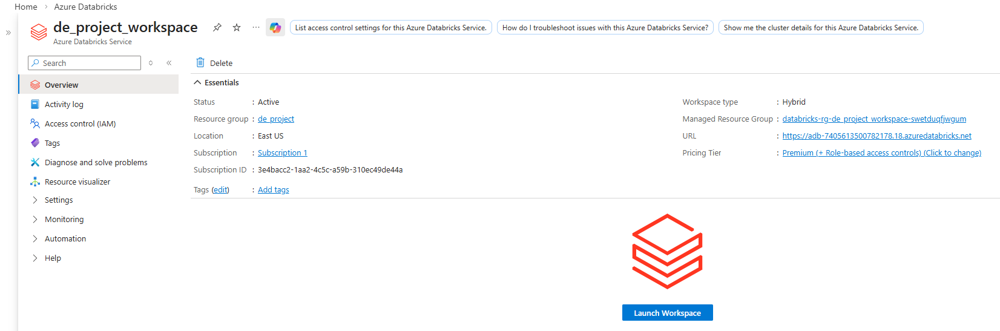
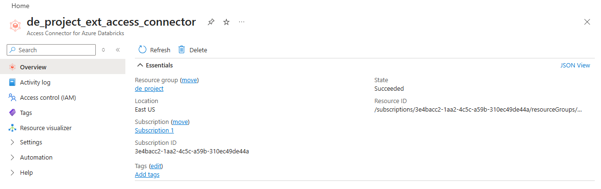
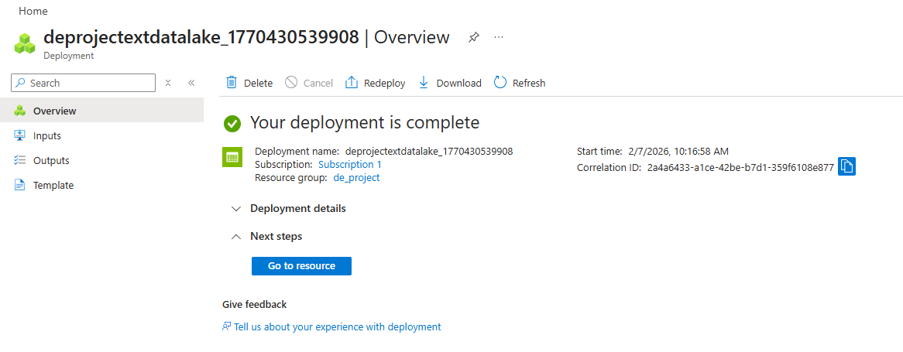
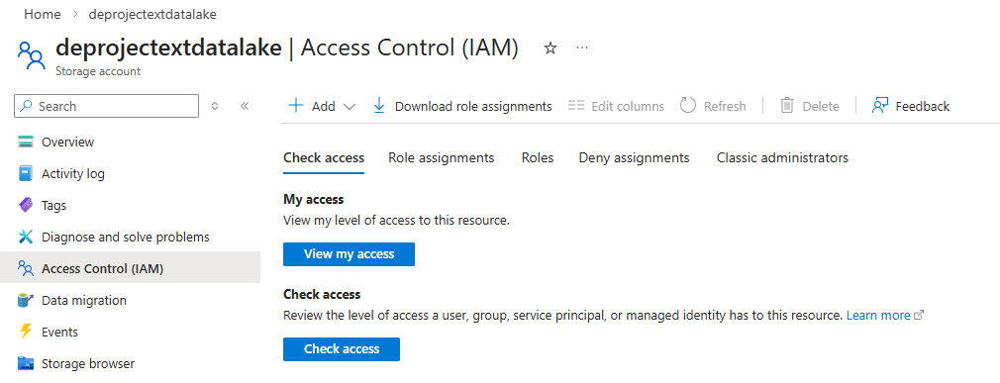
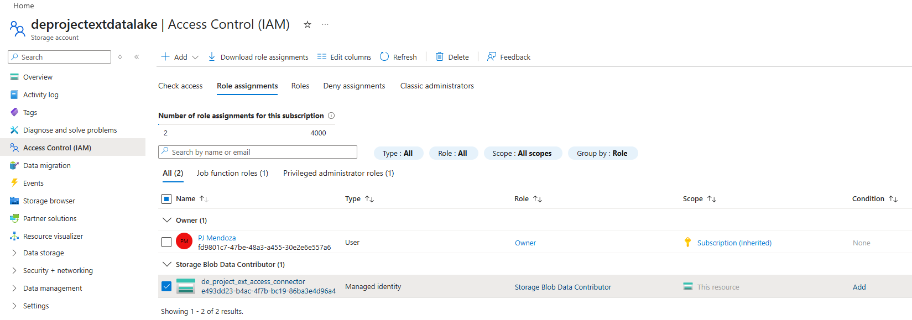
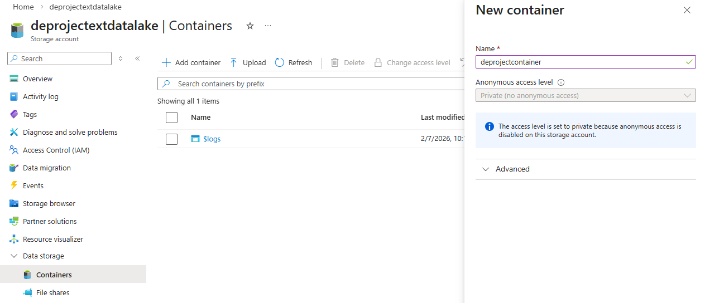
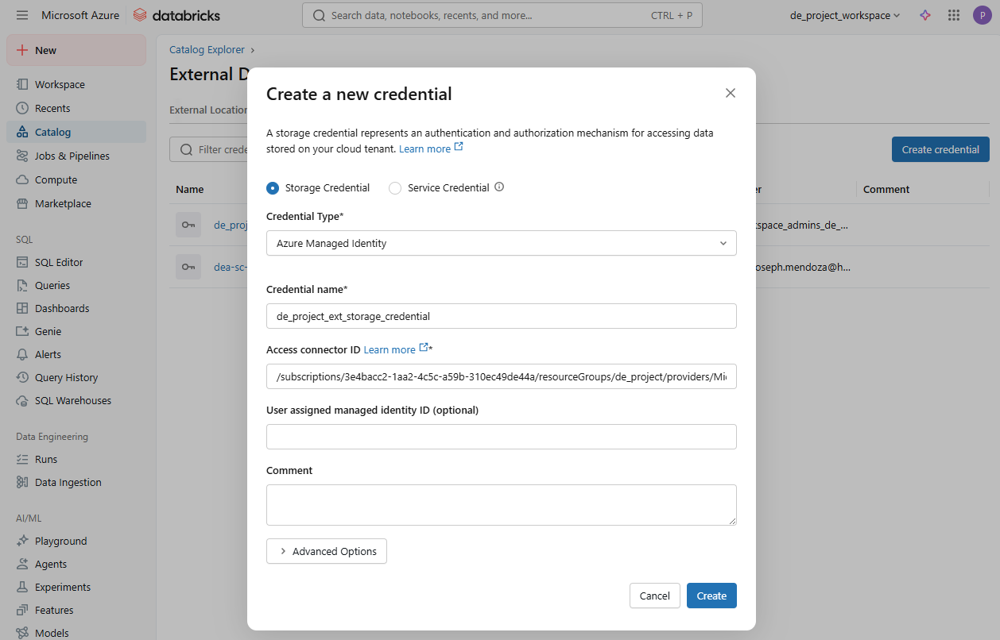
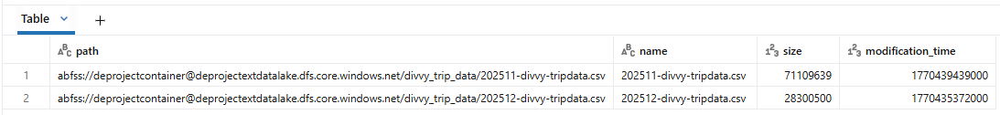

# 🛠️ Build the Azure Databricks Infrastructure

Before we can start building on Databricks and performing analysis, we need to set up the infrastructure in Azure. This involves creating a Databricks workspace, setting up an access connector to securely connect to our storage account, and configuring the storage resources to store our data.

To build the infrastructure for this project, we will need to set up the following components in Azure:

* A **Databricks Workspace** to run our data processing and analytics workloads.
* An **Access Connector** to securely connect our Databricks workspace to our storage account.
* A **Storage Account** to store our raw and processed data.
* A **Container** in the storage account to store raw data.

In Databricks' side, we will set up the following components:

* A **Storage Credential** to access the storage account.
* An **External Location** to reference the container in our storage account.


## Step 1️⃣ : Create the Azure Databricks Workspace

Search for "*Azure Databricks*" in the search bar, click on *Create*, and fill in the required details such as subscription, resource group, workspace name, region, and pricing tier.

Here we created the `de_project_workspace` in the East US region with the standard pricing tier.


Click the *Launch Workspace* button to open the Databricks UI.




## Step 2️⃣ : Create an Access Connector

Search for "*Access Connector for Azure Databricks*" in the search bar, click on *Create*, and fill in the required details, with the Databricks workspace you just created.


Here we created the `de_project_ext_access_connector` in the East US region. Take note of the **Resource ID** of the Access Connector as we will need it later in Step 6.




## Step 3️⃣ : Create the Storage Account

Search for "*Storage Account*" in the search bar, click on *Create*, and fill in the required details.

Here we created the `deprojectextdatalake` storage account in the East US region with the standard performance.



## Step 4️⃣ : Enable Access to the Storage Account

Let's enable access to the Storage Account by adding the Access Connector we created in Step 2 to the Storage Account's IAM settings.

In the *Access Control (IAM)* settings of the Storage Account `deprojectextdatalake`, add a new role assignment with the following details:
* **Role**: Storage Blob Data Contributor
* **Principal**: Select the Access Connector `de_project_ext_access_connector`.



Search for the *Storage Blob Data Contributor* role and select it.


Here we assigned the role *Storage Blob Data Contributor* to `de_project_ext_access_connector`.




## Step 5️⃣ : Create A Container

Create a container in the Storage Account to store our raw data. 

In the *Containers* section of the `deprojectextdatalake` Storage Account, click on *Add container* and provide the container name.

Here we created a container named `deprojectcontainer`.




## Step 6️⃣ : Create A Storage Credential in Databricks

Head over to the Databricks UI and create a Storage Credential that will authenticate Databricks to access the Storage Account.

In the Catalog Explorer, navigate to *Data* > *Create* > *Storage Credential* and fill in the required details.

Copy the **Resource ID** of the Access Connector we created in Step 2 and paste it in the *Access connector ID* field.



Here we created the `de_project_ext_storage_credential` storage credential.


## Step 7️⃣ : Create An External Location

Create an External Location in Databricks that references the container we created in Step 5. This will allow us to access the data in the container from Databricks. 

We can create an External Location programmatically using the DDL statement below. We'll reference the `deprojectcontainer` Container in the `deprojectextdatalake` Storage Account using the `abfss` protocol, which is used for accessing Azure Data Lake Storage Gen2. Specify the `de_project_ext_storage_credential` Storage Credential we created in Step 6 to authenticate our access to the Storage Account.

```sql
CREATE EXTERNAL LOCATION IF NOT EXISTS de_project_ext_location
URL 'abfss://deprojectcontainer@deprojectextdatalake.dfs.core.windows.net/'
WITH (STORAGE_CREDENTIAL de_project_ext_storage_credential)
COMMENT 'External location for the de_project';
```

Here we created the `de_project_ext_location` External Location.


To learn more about External Locations, check out the documentation [here](https://learn.microsoft.com/en-us/azure/databricks/sql/language-manual/sql-ref-external-locations).


## Step 8️⃣ : Upload the Datasets

Finally, upload the raw CSV files to the container in our Storage Account.

Here we created a folder `divvy_trip_data` in the `deprojectcontainer` and uploaded the 2025 datasets there.


## ✅ Verify the Setup

Verify that everything is set up correctly. We can run a simple query in Databricks to read the data from the External Location.

In the Databricks SQL Editor, run the query below to `LIST` all the files in the `divvy_trip_data` folder.

```sql
LIST 'abfss://deprojectcontainer@deprojectextdatalake.dfs.core.windows.net/divvy_trip_data/'
```

Here's the output from the query.



If the query runs successfully and returns data, then we have successfully set up the Azure Databricks infrastructure and can proceed to the next steps of building the Catalog, Schemas, and Layers. 

Hooray! 🥳