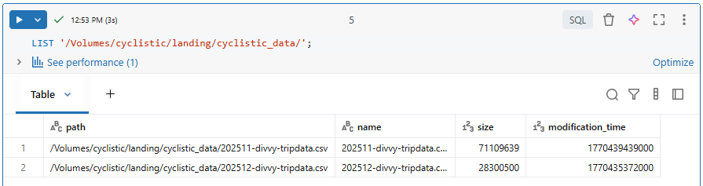
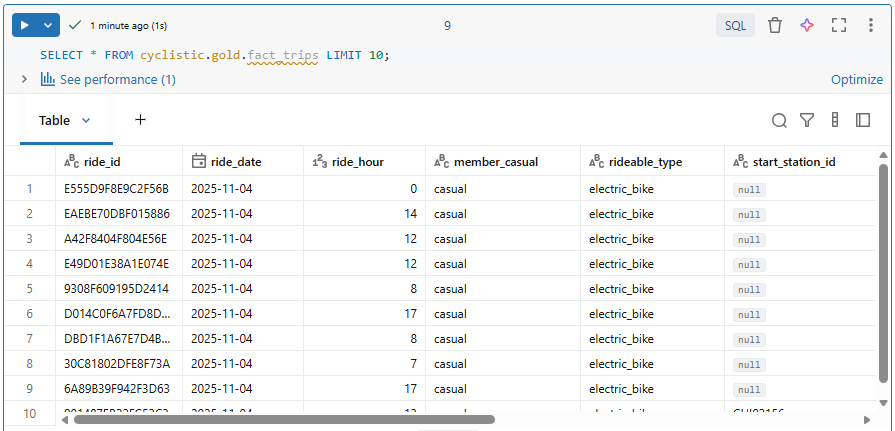
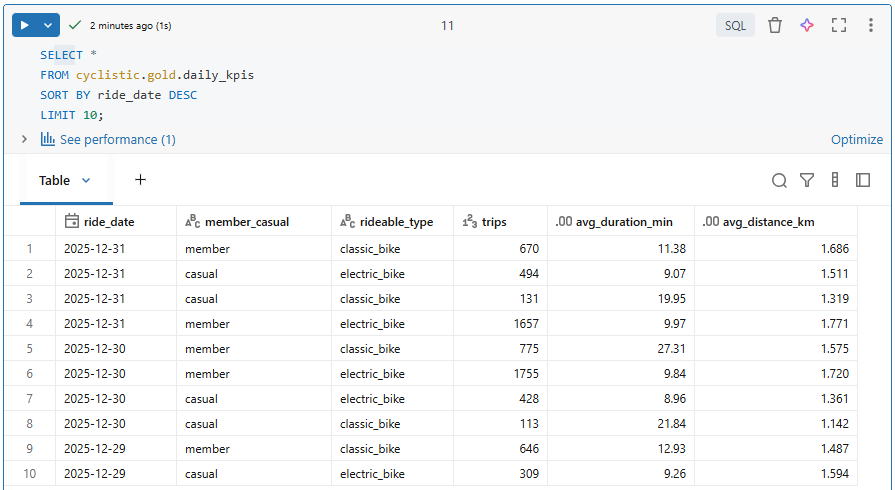

# 🏗️ Build the Landing, Bronze, Silver & Gold Layers

The **Medallion Architecture** is a data design pattern that organizes data into different layers based on its level of refinement and quality. The layers are typically named Landing, Bronze, Silver, and Gold. Each layer serves a specific purpose in the data processing pipeline, allowing for better organization, governance, and scalability of data.

In this section, we will build each layer of the Medallion Architecture, starting with the Landing layer where we will "land" the raw data files from source, followed by the Bronze layer for raw ingested data, the Silver layer for cleansed and conformed data, and finally the Gold layer for analytics and reporting.


## 📦 Build the Landing Layer

The Landing layer is where we will store the raw data files as they are ingested from the external source. Here we will create an external volume that points to the location of the raw data files in our Azure Storage Account.

**Note**: In a production environment, you would typically use a more secure method to manage access to your storage account, such as using **Azure Managed Identities** or **Databricks Secrets**. 

### Create DDL for External Volume

```sql
USE CATALOG cyclistic;
USE SCHEMA landing;

CREATE EXTERNAL VOLUME IF NOT EXISTS cyclistic_data
LOCATION 'abfss://deprojectcontainer@deprojectextdatalake.dfs.core.windows.net/divvy_trip_data/'
COMMENT 'External volume for cyclistic raw data';
```

### Verify the External Volume

```sql
DESCRIBE VOLUME cyclistic.landing.cyclistic_data;
```

### Retrieve the Volume Directory for the Bronze Layer Ingestion Script

```sql
SELECT CONCAT('/Volumes/', volume_catalog, '/', volume_schema, '/', volume_name, '/') AS volume_path
FROM information_schema.volumes 
WHERE volume_name = 'cyclistic_data';
```

Here's the output from Databricks:


### List Files in cyclistic_data Volume

```sql
LIST '/Volumes/cyclistic/landing/cyclistic_data/';
```

Here's the output from Databricks:



You can also view it in the Databricks UI:


## 🥉 Build the Bronze Layer

The Bronze layer is where we will store the raw ingested data in a Delta table format. This layer serves as the foundation for further data processing and cleansing.

We wll also add ingestion metadata columns to track the source file and ingestion timestamp.

**Note**: In a production environment, you would typically implement more robust data validation and error handling mechanisms during the ingestion process.


### Create DDL for the *trips_raw* Table

The DDL below creates the Bronze Delta table `trips_raw` with ingestion metadata columns. DDL stands for **Data Definition Language**, which is used to define and manage database structures.

```sql
USE CATALOG cyclistic;
USE SCHEMA bronze;

CREATE TABLE IF NOT EXISTS trips_raw (
  ride_id            STRING,
  rideable_type      STRING,
  started_at         TIMESTAMP,
  ended_at           TIMESTAMP,
  start_station_name STRING,
  start_station_id   STRING,
  end_station_name   STRING,
  end_station_id     STRING,
  start_lat          DOUBLE,
  start_lng          DOUBLE,
  end_lat            DOUBLE,
  end_lng            DOUBLE,
  member_casual      STRING,
  _ingest_file       STRING,
  _ingest_ts         TIMESTAMP
)
COMMENT 'Raw Cyclistic data stored as Delta';
```


### Develop SQL Load Script

Here we will load the raw CSV files into the Bronze Delta table using the `COPY INTO` command. This command is efficient and handles schema evolution. The COPY INTO command is **idempotent**, meaning it can be run multiple times without duplicating data, as it tracks which files have already been loaded.

Note: Adjust the volume path in the `FROM` clause to match the location of your raw data files.

```sql
COPY INTO trips_raw
FROM (
  SELECT
    ride_id,
    rideable_type,
    to_timestamp(started_at)  AS started_at,
    to_timestamp(ended_at)    AS ended_at,
    start_station_name,
    start_station_id,
    end_station_name,
    end_station_id,
    CAST(start_lat AS DOUBLE) AS start_lat,
    CAST(start_lng AS DOUBLE) AS start_lng,
    CAST(end_lat   AS DOUBLE) AS end_lat,
    CAST(end_lng   AS DOUBLE) AS end_lng,
    member_casual,
    _metadata.file_name       AS _ingest_file,
    current_timestamp()       AS _ingest_ts
  FROM '/Volumes/cyclistic/landing/cyclistic_data/'
)
FILEFORMAT = CSV
FORMAT_OPTIONS ('header' = 'true', 'multiLine'='false')
COPY_OPTIONS ('mergeSchema'='true');  -- safe for extra cols in future
```

Here's the output from Databricks:


## 🥈 Build the Silver Layer

The Silver layer is where we will store the cleansed and conformed data. This layer is optimized for analytics and reporting.


### Explore & Understand The Data

Here are some key data quality checks and transformations we will perform in the Silver layer:
*   **Null Handling**: Remove records with null `started_at` or `ended_at`.
*   **Duration Calculation**: Calculate trip duration in seconds and minutes; remove records with non-positive durations.
*   **Geographical Validation**: Ensure latitude and longitude values are within valid ranges.
*   **Distance Calculation**: Compute Haversine distance between start and end coordinates.
*   **Self-loop Detection**: Identify trips that start and end at the same station or coordinates.


### Create DDL for the *trips_clean* Table

```sql
USE CATALOG cyclistic;
USE SCHEMA silver;

CREATE TABLE IF NOT EXISTS trips_clean
(
  ride_id            STRING NOT NULL,
  rideable_type      STRING NOT NULL,
  started_at         TIMESTAMP NOT NULL,
  ended_at           TIMESTAMP NOT NULL,
  ride_date          DATE NOT NULL,
  ride_hour          TINYINT NOT NULL,
  duration_sec       INT NOT NULL,
  duration_min       DECIMAL(9,2) NOT NULL,
  start_station_id   STRING,
  start_station_name STRING,
  end_station_id     STRING,
  end_station_name   STRING,
  start_lat          DOUBLE NOT NULL,
  start_lng          DOUBLE NOT NULL,
  end_lat            DOUBLE NOT NULL,
  end_lng            DOUBLE NOT NULL,
  distance_km        DECIMAL(9,3) NOT NULL,
  is_self_loop       BOOLEAN NOT NULL,
  member_casual      STRING NOT NULL,
  _src_file          STRING NOT NULL,
  _load_date         DATE NOT NULL
)
USING DELTA
PARTITIONED BY (_load_date)
TBLPROPERTIES (
  'delta.autoOptimize.optimizeWrite'='true',
  'delta.autoOptimize.autoCompact'='true'
);
```


### Create the Haversine Function

The Haversine formula calculates the distance between two points on the surface of a sphere given their latitude and longitude. This function will be used to compute the distance between the start and end locations of each trip.

If the Haversine formula returned 0, it would imply that the two points are identical, meaning the trip started and ended at the same location - a self-loop.

To know more about the Haversine formula, you can check out this [Wikipedia article](https://en.wikipedia.org/wiki/Haversine_formula).

```sql
USE CATALOG cyclistic;
USE SCHEMA silver;

CREATE OR REPLACE FUNCTION silver.haversine_km(
  lat1 DOUBLE, lon1 DOUBLE, lat2 DOUBLE, lon2 DOUBLE
) RETURNS DOUBLE
RETURN 2*6371*asin(sqrt(
  pow(sin(radians(lat2-lat1)/2),2) +
  cos(radians(lat1))*cos(radians(lat2))*pow(sin(radians(lon2-lon1)/2),2)
));
```


### Transform and Load Data

The Transform process is probably the most exciting part of this project. It is where we apply the data quality checks and transformations to cleanse the data.

We begin by selecting data from the Bronze layer (`trips_raw`) and applying the necessary transformations and filters to create a clean and conformed dataset in the Silver layer (`trips_clean`). Then, we use the `MERGE INTO` statement to perform an upsert operation, ensuring that our Silver layer is always up-to-date and consistent with the latest data from the Bronze layer.

The `MERGE INTO` statement is used to perform an **upsert** operation, which means it will **update** existing records in the `trips_clean` table if they already exist based on `ride_id`, or **insert** new records if they do not exist yet.

The SQL code below has several key components:
*   **Source Selection**: Select data from the Bronze layer (`trips_raw`).
*   **Data Quality Filters**: Apply filters in the `WHERE` clause to remove records with null values, non-positive durations, and out-of-range geographical coordinates.
*   **Derived Columns**: Calculate new columns such as `ride_date`, `ride_hour`, `duration_sec`, `duration_min`, `distance_km`, and `is_self_loop`.

```sql
MERGE INTO trips_clean tc
USING 
(
  SELECT
    br.ride_id,
    br.rideable_type,
    br.started_at,
    br.ended_at,
    DATE(br.started_at) AS ride_date,
    HOUR(br.started_at) AS ride_hour,
    CAST((unix_timestamp(br.ended_at)-unix_timestamp(br.started_at)) AS INT) AS duration_sec,
    ROUND((unix_timestamp(br.ended_at)-unix_timestamp(br.started_at))/60.0,2) AS duration_min,
    br.start_station_id,
    br.start_station_name,
    br.end_station_id,
    br.end_station_name,
    br.start_lat, br.start_lng, br.end_lat, br.end_lng,
    CAST(silver.haversine_km(br.start_lat, br.start_lng, br.end_lat, br.end_lng) AS DECIMAL(9,3)) AS distance_km,
    (br.start_station_id <=> br.end_station_id 
     OR (round(br.start_lat,6) <=> round(br.end_lat,6) AND round(br.start_lng,6) <=> round(br.end_lng,6))) AS is_self_loop,
    br.member_casual,
    br._ingest_file AS _src_file,
    DATE(br._ingest_ts) AS _load_date
  FROM cyclistic.bronze.trips_raw br
  WHERE br.started_at IS NOT NULL
    AND br.ended_at   IS NOT NULL
    AND br.ended_at   >  br.started_at
    AND br.start_lat BETWEEN -90 AND 90
    AND br.end_lat   BETWEEN -90 AND 90
    AND br.start_lng BETWEEN -180 AND 180
    AND br.end_lng   BETWEEN -180 AND 180
) tr
ON tc.ride_id   = tr.ride_id
WHEN MATCHED THEN UPDATE SET *
WHEN NOT MATCHED THEN INSERT *;
```

Optional performance tuning using `ZORDER`. The `OPTIMIZE` command reorganizes the data in the table to improve query performance. `ZORDER` is a technique that optimizes the layout of data on disk to improve query performance, especially for queries that filter on specific columns. By ZORDERing the `trips_clean` table by `ride_date`, `member_casual`, and `start_station_id`, we can significantly speed up queries that filter on these columns, which are common in our use case. 

```sql
OPTIMIZE trips_clean ZORDER BY (ride_date, member_casual, start_station_id);
```

Here's the output from Databricks:


## 🥇 Build the Gold Layer

The Gold layer is where we will store the modeled data that is optimized for analytics and reporting. This layer typically contains fact and dimension tables, as well as pre-aggregated tables for common queries. 

In this project, we will create a fact table for the trips and a dimension table for the stations. We will also create some pre-aggregated tables to support common queries and KPIs.


### Create the Fact Table

The fact table is designed to support analytics on bike trips, allowing us to analyze patterns and trends in bike usage across different user types, bike types, and time periods. 

We create the fact table `fact_trips` using CTAS (Create Table As Select) to select data from the Silver layer (`trips_clean`) and store it in a new Delta table in the Gold layer. We also partition the table by `ride_date` to optimize query performance for time-based analyses, which are common in this use case. Finally, we apply ZORDERing to further optimize query performance for common filter columns.

```sql
USE CATALOG cyclistic;
USE SCHEMA gold;

CREATE TABLE IF NOT EXISTS fact_trips
USING DELTA
PARTITIONED BY (ride_date)
AS
SELECT
  ride_id, 
  ride_date, 
  ride_hour, 
  member_casual, 
  rideable_type, 
  start_station_id, 
  end_station_id,
  duration_sec, 
  duration_min, 
  distance_km, 
  is_self_loop
FROM cyclistic.silver.trips_clean;

OPTIMIZE fact_trips ZORDER BY (member_casual, rideable_type);
```


### Create the Dimension Table

The dimension table is designed to provide descriptive information about the stations, allowing us to analyze bike usage patterns based on station locations and names.

We create the dimension table `dim_station` by selecting distinct station IDs and names from the Silver layer (`trips_clean`). We use `COALESCE` to handle cases where a station may only appear as a start or end station, ensuring that we capture all unique stations in our dimension table.

```sql
CREATE OR REPLACE TABLE dim_station AS
SELECT DISTINCT
  COALESCE(start_station_id, end_station_id) AS station_id,
  COALESCE(start_station_name, end_station_name) AS station_name
FROM cyclistic.silver.trips_clean
WHERE COALESCE(start_station_id, end_station_id) IS NOT NULL;
```


### Create the KPIs and Metrics

 We create the `daily_kpis` table to store key performance indicators (KPIs) such as the number of trips, average duration, and average distance, aggregated by `ride_date`, `member_casual`, and `rideable_type`. This pre-aggregated table will allow us to quickly analyze trends and patterns in bike usage across different user types and bike types over time.

```sql
CREATE OR REPLACE TABLE daily_kpis AS
SELECT
  ride_date,
  member_casual,
  rideable_type,
  COUNT(*)                      AS trips,
  ROUND(AVG(duration_min),2)    AS avg_duration_min,
  ROUND(AVG(distance_km),3)     AS avg_distance_km
FROM cyclistic.silver.trips_clean
GROUP BY ride_date, member_casual, rideable_type;
```

We create the `station_hourly` table to analyze the number of departures from each station on an hourly basis. This will help us understand station-level usage patterns and identify peak hours for bike departures.

```sql
CREATE OR REPLACE TABLE station_hourly AS
SELECT
  ride_date,
  ride_hour,
  start_station_id,
  COUNT(*) AS departures
FROM cyclistic.silver.trips_clean
GROUP BY ride_date, ride_hour, start_station_id;

OPTIMIZE daily_kpis ZORDER BY (ride_date);
```


### Check the Gold Layer Tables

The `fact_trips` table



The `dim_station` table


The `daily_kpis` table



The `station_hourly` table


We have successfully built the Landing, Bronze, Silver, and Gold layers of our Medallion Architecture on Databricks! Next we will explore the data and create some visualizations to gain insights from the data.