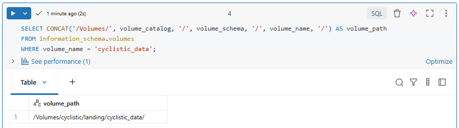
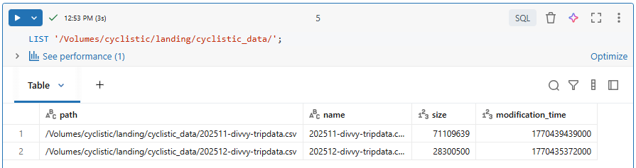
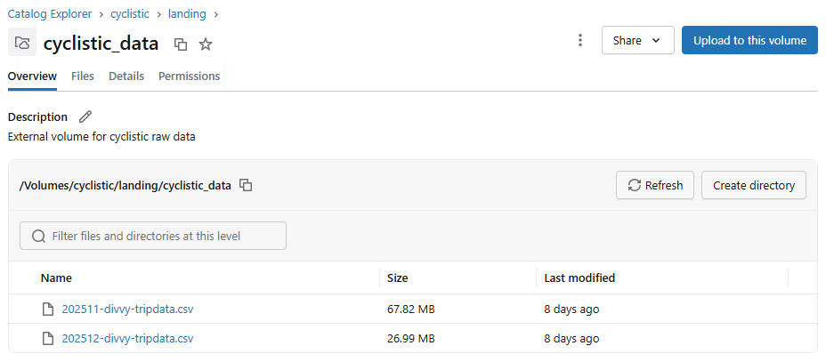

# 🏗️ Build the Landing, Bronze, Silver & Gold Layers

The **Medallion Architecture** is a data design pattern that organizes data into different layers based on its level of refinement and quality. The layers are typically named Landing, Bronze, Silver, and Gold. Each layer serves a specific purpose in the data processing pipeline, allowing for better organization, governance, and scalability of data.

In this section, we will build each layer of the Medallion Architecture, starting with the Landing layer where we will "land" the raw data files from source, followed by the Bronze layer for raw ingested data, the Silver layer for cleansed and conformed data, and finally the Gold layer for analytics and reporting.


## 📦 Build the Landing Layer

The Landing layer is where we will store the raw data files as they are ingested from the external source. Here we will create an external volume that points to the location of the raw data files in our Azure Storage Account.

**Note**: In a production environment, you would typically use a more secure method to manage access to your storage account, such as using **Azure Managed Identities** or **Databricks Secrets**. 

### Create DDL for External Volume

```sql
USE CATALOG cyclistic;
USE SCHEMA landing;

CREATE EXTERNAL VOLUME IF NOT EXISTS cyclistic_data
LOCATION 'abfss://deprojectcontainer@deprojectextdatalake.dfs.core.windows.net/divvy_trip_data/'
COMMENT 'External volume for cyclistic raw data';
```

### Verify the External Volume

```sql
DESCRIBE VOLUME cyclistic.landing.cyclistic_data;
```

### Retrieve the Volume Directory for the Bronze Layer Ingestion Script

```sql
SELECT CONCAT('/Volumes/', volume_catalog, '/', volume_schema, '/', volume_name, '/') AS volume_path
FROM information_schema.volumes 
WHERE volume_name = 'cyclistic_data';
```

Here's the output from Databricks:




### List Files in cyclistic_data Volume

```sql
LIST '/Volumes/cyclistic/landing/cyclistic_data/';
```

Here's the output from Databricks:



You can also view it in the Databricks UI:



---