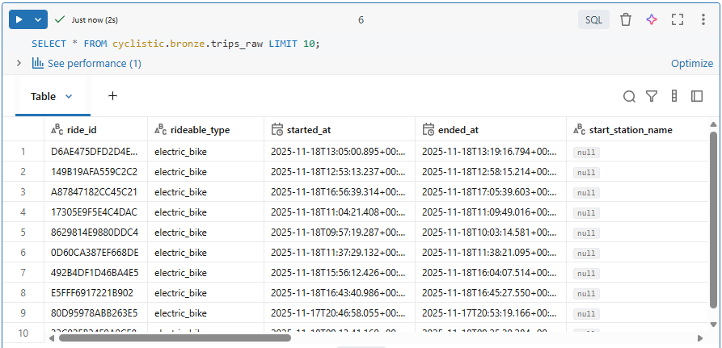

## 🥉 Build the Bronze Layer

The Bronze layer is where we will store the raw ingested data in a Delta table format. This layer serves as the foundation for further data processing and cleansing.

We wll also add ingestion metadata columns to track the source file and ingestion timestamp.

**Note**: In a production environment, you would typically implement more robust data validation and error handling mechanisms during the ingestion process.


### 1️⃣ Create DDL for the *trips_raw* Table

The DDL below creates the Bronze Delta table `trips_raw` with ingestion metadata columns. DDL stands for **Data Definition Language**, which is used to define and manage database structures.

```sql
USE CATALOG cyclistic;
USE SCHEMA bronze;

CREATE TABLE IF NOT EXISTS trips_raw (
  ride_id            STRING,
  rideable_type      STRING,
  started_at         TIMESTAMP,
  ended_at           TIMESTAMP,
  start_station_name STRING,
  start_station_id   STRING,
  end_station_name   STRING,
  end_station_id     STRING,
  start_lat          DOUBLE,
  start_lng          DOUBLE,
  end_lat            DOUBLE,
  end_lng            DOUBLE,
  member_casual      STRING,
  _ingest_file       STRING,
  _ingest_ts         TIMESTAMP
)
COMMENT 'Raw Cyclistic data stored as Delta';
```


### 2️⃣ Develop SQL Load Script

Here we will load the raw CSV files into the Bronze Delta table using the `COPY INTO` command. This command is efficient and handles schema evolution. The COPY INTO command is **idempotent**, meaning it can be run multiple times without duplicating data, as it tracks which files have already been loaded.

Note: Adjust the volume path in the `FROM` clause to match the location of your raw data files.

```sql
COPY INTO trips_raw
FROM (
  SELECT
    ride_id,
    rideable_type,
    to_timestamp(started_at)  AS started_at,
    to_timestamp(ended_at)    AS ended_at,
    start_station_name,
    start_station_id,
    end_station_name,
    end_station_id,
    CAST(start_lat AS DOUBLE) AS start_lat,
    CAST(start_lng AS DOUBLE) AS start_lng,
    CAST(end_lat   AS DOUBLE) AS end_lat,
    CAST(end_lng   AS DOUBLE) AS end_lng,
    member_casual,
    _metadata.file_name       AS _ingest_file,
    current_timestamp()       AS _ingest_ts
  FROM '/Volumes/cyclistic/landing/cyclistic_data/'
)
FILEFORMAT = CSV
FORMAT_OPTIONS ('header' = 'true', 'multiLine'='false')
COPY_OPTIONS ('mergeSchema'='true');  -- safe for extra cols in future
```


### 3️⃣ Verify the Bronze Table

Here's the output from Databricks:




### ✨ Alternative: Load Script Using PySpark

We can use the PySpark code below to read the raw CSV files as a stream from the Landing layer, transform the data, and write it to the Bronze Delta table. This approach allows for continuous ingestion of new files as they arrive in the Landing layer.

```python
from pyspark.sql.functions import *

# Set the source path for the raw CSV files in the Landing layer
src = "/Volumes/cyclistic/landing/cyclistic_data/"

# Read raw CSV files as a stream from the Landing layer
df_raw = (
    spark.readStream
        .format("cloudFiles") # Enable Auto Loader
        .option("cloudFiles.format", "csv")
        .option("header", "true")
        .load(src)
)

# Transform the data
df_transformed = (
    df_raw.select(
        col("ride_id"),
        col("rideable_type"),
        to_timestamp("started_at").alias("started_at"),
        to_timestamp("ended_at").alias("ended_at"),
        col("start_station_name"),
        col("start_station_id"),
        col("end_station_name"),
        col("end_station_id"),
        col("start_lat").cast("double").alias("start_lat"),
        col("start_lng").cast("double").alias("start_lng"),
        col("end_lat").cast("double").alias("end_lat"),
        col("end_lng").cast("double").alias("end_lng"),
        col("member_casual"),
        input_file_name().alias("_ingest_file"),
        current_timestamp().alias("_ingest_ts")
    )
)

# Write the transformed data to the Bronze Delta table "trips_raw"
(
    df_transformed.writeStream
        .option("checkpointLocation", "/Volumes/cyclistic/checkpoints/trips_raw") # Set the checkpoint location for fault tolerance
        .trigger(availableNow=True) # Process all available files once, then stop
        .toTable("cyclistic.bronze.trips_raw") # Write to Delta table, equivalent to COPY INTO command
)
```

---