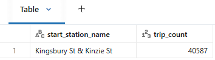
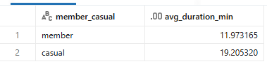
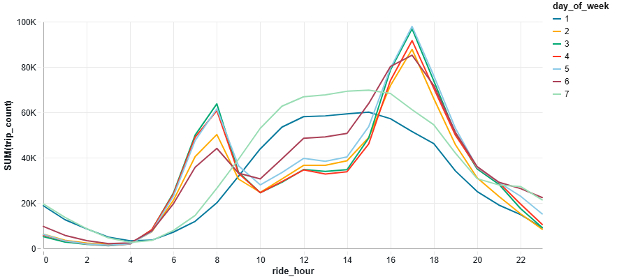
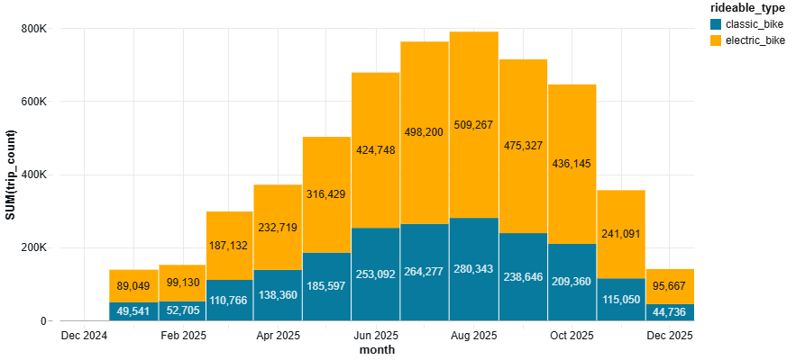
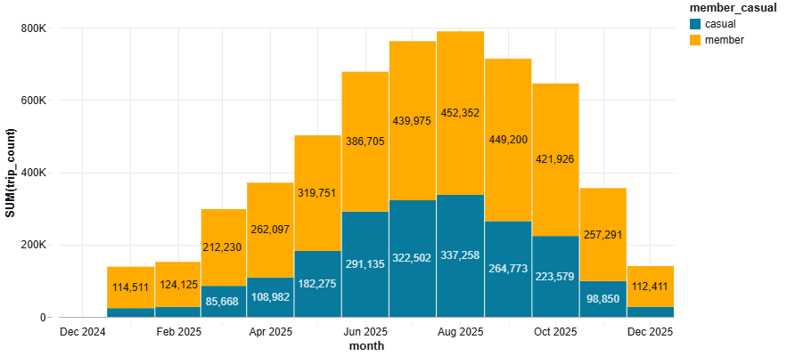

# 📊 Perform Exploratory Data Analysis & Visualization

Exploratory Data Analysis (EDA) and Visualization are important steps in the data analysis process. This is the stage where a Data/Business Analyst explores the data to understand its structure, identify patterns, and gain insights that can inform our analysis and decision-making. We're not an analyst here, but hey, we can do EDA too!

In this section, we will perform EDA on the cleaned and conformed data in the Silver layer. We prepared five questions to guide our analysis efforts. Our goal in this analysis is to gain insights into the usage patterns of Cyclistic's bike-sharing service, identify trends, and (hopefully) help the business make informed decisions.


## Q1: Which station is the most popular among Cyclistic users?

```sql
SELECT
    start_station_name,
    COUNT(*) AS trip_count
FROM cyclistic.silver.trips_clean
WHERE start_station_name IS NOT NULL
GROUP BY start_station_name
ORDER BY trip_count DESC
LIMIT 1;
```



The most popular station is **Kingsbury St & Kinzie St**, with a total of **40,587 trips**.


## Q2: Which type of user rides the bikes longer? Determine the average trip duration in minutes.

```sql
SELECT
    member_casual,
    AVG(duration_min) AS avg_duration_min
FROM cyclistic.silver.trips_clean
WHERE member_casual IS NOT NULL AND duration_min IS NOT NULL
GROUP BY member_casual;
```



🔍 The average trip duration for members is **11.97 minutes**, while casual riders take **19.21 minutes**. Casual riders tend to take longer trips compared to members.


## Q3: At which period of the day and week is the bike activity the highest? Create a profile of bike activity across the day and week.

```sql
%sql
SELECT
    EXTRACT(DAYOFWEEK FROM ride_date) AS day_of_week, -- starts Sunday
    ride_hour,
    COUNT(*) AS trip_count
FROM cyclistic.silver.trips_clean
WHERE ride_hour IS NOT NULL AND ride_date IS NOT NULL
GROUP BY day_of_week, ride_hour
ORDER BY day_of_week, ride_hour;
```



📈 The x-axis represents the hour of the day (0000H until 2359H), and the y-axis represents the sum of trips recorded. The legend represents the day of the week an activity occurred, where 1 is Sunday and 7 is Saturday.

🔍 Trip activity varies significantly by both hour and day of the week, with the highest volumes generally occurring in the afternoon and evening hours. Notable data points include:

* On weekdays (Monday to Friday), there are clear peaks in activity during the morning at 8AM (0800H), and evening rush hours at 5PM (1700H).
* On weekends (Saturday and Sunday), there's a steady trend of activity from noon until the afternoon (12NN-4PM). The peak activity tends to occur slightly earlier in the afternoon, around 3PM (1500H) on Sunday and 2PM (1400H) on Saturday.
* Early morning hours (0000H to 0500H) consistently have the lowest trip counts across all days.


## Q4: What's the distribution of bike users in each month? Create a profile of bike activity across the year and segregate by ride type and member type.

```sql
SELECT
    DATE_TRUNC('MONTH', started_at) AS month,
    rideable_type,
    member_casual,
    COUNT(*) AS trip_count
FROM cyclistic.silver.trips_clean
WHERE started_at IS NOT NULL AND rideable_type IS NOT NULL
GROUP BY month, rideable_type, member_casual
ORDER BY month, rideable_type, member_casual;
```
### Disctribution of bike users by month, segregated by *ride* type:



🔍 Trip activity by month shows a clear seasonal trend, with the highest usage in summer through fall months and lower activity in winter. 

* Electric bikes consistently have more trips than classic bikes each month.
* Peak activity occurs from July to September, with electric bikes showing the largest growth during these months.

### Disctribution of bike users by month, segregated by *member* type:



🔍 Trip activity by month shows a clear seasonal trend, with the highest usage in summer through fall months and lower activity in winter. 

* Members consistently have more trips than casual riders each month.
* Peak activity occurs from July to September, with members showing the largest growth during these months.
* Casual riders also show a significant increase during the summer months, but their overall trip counts remain lower than members throughout the year.


## Q5: How does the distance covered vary by ride type across different start stations?

```sql
SELECT
    rideable_type,
    start_station_name,
    SUM(distance_km) AS total_distance_km
FROM cyclistic.silver.trips_clean
WHERE rideable_type         IS NOT NULL
    AND start_station_name  IS NOT NULL
    AND distance_km         IS NOT NULL
GROUP BY rideable_type, start_station_name
ORDER BY total_distance_km DESC
LIMIT 20;
```


🔍 The distance covered varies by ride type and start station. 

* Electric bikes generally cover more distance than classic bikes, likely due to their ease of use and ability to assist riders on longer trips.

* Classic bikes take the top six positions in terms of total distance covered, with the highest distance recorded at DuSable Lake Shore Dr & North Blvd (52,178.5 km) and Michigan Ave & Oak St (51,242.2 km).


## 💡 Summary of EDA Findings

1. **Most Popular Station**: Kingsbury St & Kinzie St is the most popular station with 40,587 trips.
2. **Average Trip Duration**: Casual riders take longer trips (19.21 minutes) compared to members (11.97 minutes).
3. **Bike Activity by Time**: Trip activity peaks during weekday rush hours (8AM and 5PM) and a steady trend on weekends from noon until afternoon (12NN-4PM).
4. **Seasonal Trends**: Bike usage is highest in summer months (July to September), with electric bikes and members showing the largest growth during this period.
5. **Distance Covered**: Electric bikes generally cover more distance than classic bikes. Classic bikes, however, take the top six positions in terms of total distance covered.