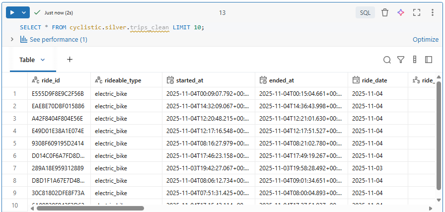

## 🥈 Build the Silver Layer

The Silver layer is where we will store the cleansed and conformed data. This layer is optimized for analytics and reporting.

Here are some key data quality checks and transformations we will perform in the Silver layer:
*   **Null Handling**: Remove records with null `started_at` or `ended_at`.
*   **Duration Calculation**: Calculate trip duration in seconds and minutes; remove records with non-positive durations.
*   **Geographical Validation**: Ensure latitude and longitude values are within valid ranges.
*   **Distance Calculation**: Compute Haversine distance between start and end coordinates.
*   **Self-loop Detection**: Identify trips that start and end at the same station or coordinates.


### 1️⃣ Create DDL for the *trips_clean* Table

```sql
USE CATALOG cyclistic;
USE SCHEMA silver;

CREATE TABLE IF NOT EXISTS trips_clean
(
  ride_id            STRING NOT NULL,
  rideable_type      STRING NOT NULL,
  started_at         TIMESTAMP NOT NULL,
  ended_at           TIMESTAMP NOT NULL,
  ride_date          DATE NOT NULL,
  ride_hour          TINYINT NOT NULL,
  duration_sec       INT NOT NULL,
  duration_min       DECIMAL(9,2) NOT NULL,
  start_station_id   STRING,
  start_station_name STRING,
  end_station_id     STRING,
  end_station_name   STRING,
  start_lat          DOUBLE NOT NULL,
  start_lng          DOUBLE NOT NULL,
  end_lat            DOUBLE NOT NULL,
  end_lng            DOUBLE NOT NULL,
  distance_km        DECIMAL(9,3) NOT NULL,
  is_self_loop       BOOLEAN NOT NULL,
  member_casual      STRING NOT NULL,
  _src_file          STRING NOT NULL,
  _load_date         DATE NOT NULL
)
USING DELTA
PARTITIONED BY (_load_date)
TBLPROPERTIES (
  'delta.autoOptimize.optimizeWrite'='true',
  'delta.autoOptimize.autoCompact'='true'
);
```

#### ✨ PySpark Alternative

```python
from pyspark.sql.types import *

spark.sql("USE CATALOG cyclistic")
spark.sql("CREATE SCHEMA IF NOT EXISTS silver")
spark.sql("CREATE TABLE IF NOT EXISTS trips_clean ...")
```


### 2️⃣ Create the Haversine Function

The `Haversine formula` calculates the distance between two points on the surface of a sphere given their latitude and longitude. This function will be used to compute the distance between the start and end locations of each trip.

If the Haversine formula returned 0, it would imply that the two points are identical, meaning the trip started and ended at the same location - a self-loop.

To know more about the Haversine formula, you can check out this [Wikipedia article](https://en.wikipedia.org/wiki/Haversine_formula).

```sql
USE CATALOG cyclistic;
USE SCHEMA silver;

CREATE OR REPLACE FUNCTION silver.haversine_km(
  lat1 DOUBLE, lon1 DOUBLE, lat2 DOUBLE, lon2 DOUBLE
) RETURNS DOUBLE
RETURN 2*6371*asin(sqrt(
  pow(sin(radians(lat2-lat1)/2),2) +
  cos(radians(lat1))*cos(radians(lat2))*pow(sin(radians(lon2-lon1)/2),2)
));
```

#### ✨ PySpark Alternative

```python
from pyspark.sql.functions import col, radians, sin, cos, asin, sqrt, pow

# Earth radius in KM
EARTH_RADIUS = 6371.0

# Spark Column expression
haversine_km = (
    2 * EARTH_RADIUS *
    asin(
        sqrt(
            pow(sin(radians(col("end_lat") - col("start_lat")) / 2), 2)
            + cos(radians(col("start_lat"))) * cos(radians(col("end_lat")))
            * pow(sin(radians(col("end_lng") - col("start_lng")) / 2), 2)
        )
    )
)
```


### 3️⃣ Transform and Load Data

The Transform process is probably the most exciting part of this project. It is where we apply the data quality checks and transformations to cleanse the data.

We begin by selecting data from the Bronze layer (`trips_raw`) and applying the necessary transformations and filters to create a clean and conformed dataset in the Silver layer (`trips_clean`). Then, we use the `MERGE INTO` statement to perform an upsert operation, ensuring that our Silver layer is always up-to-date and consistent with the latest data from the Bronze layer.

The `MERGE INTO` statement is used to perform an **upsert** operation, which means it will **update** existing records in the `trips_clean` table if they already exist based on `ride_id`, or **insert** new records if they do not exist yet.

The SQL code below has several key components:
*   **Source Selection**: Select data from the Bronze layer (`trips_raw`).
*   **Data Quality Filters**: Apply filters in the `WHERE` clause to remove records with null values, non-positive durations, and out-of-range geographical coordinates.
*   **Derived Columns**: Calculate new columns such as `ride_date`, `ride_hour`, `duration_sec`, `duration_min`, `distance_km`, and `is_self_loop`.
* **Upsert Operation**: Use the `MERGE INTO` statement to update existing records or insert new records into the Silver layer (`trips_clean`) based on the unique identifier `ride_id`.

```sql
MERGE INTO trips_clean tc
USING 
(
  SELECT
    br.ride_id,
    br.rideable_type,
    br.started_at,
    br.ended_at,

    -- Derived columns
    DATE(br.started_at) AS ride_date,
    HOUR(br.started_at) AS ride_hour,
    CAST((unix_timestamp(br.ended_at)-unix_timestamp(br.started_at)) AS INT) AS duration_sec,
    ROUND((unix_timestamp(br.ended_at)-unix_timestamp(br.started_at))/60.0,2) AS duration_min,
    
    br.start_station_id,
    br.start_station_name,
    br.end_station_id,
    br.end_station_name,
    br.start_lat, br.start_lng, br.end_lat, br.end_lng,

    -- Derived columns
    CAST(silver.haversine_km(br.start_lat, br.start_lng, br.end_lat, br.end_lng) AS DECIMAL(9,3)) AS distance_km,
    (br.start_station_id <=> br.end_station_id 
     OR (round(br.start_lat,6) <=> round(br.end_lat,6) AND round(br.start_lng,6) <=> round(br.end_lng,6))) AS is_self_loop,
    
    br.member_casual,
    
    -- Metadata columns
    br._ingest_file AS _src_file,
    DATE(br._ingest_ts) AS _load_date
  
  FROM cyclistic.bronze.trips_raw br
  
  -- Data quality filters  
  WHERE br.started_at IS NOT NULL
    AND br.ended_at   IS NOT NULL
    AND br.ended_at   >  br.started_at
    AND br.start_lat BETWEEN -90 AND 90
    AND br.end_lat   BETWEEN -90 AND 90
    AND br.start_lng BETWEEN -180 AND 180
    AND br.end_lng   BETWEEN -180 AND 180
) tr

-- Upsert operation
-- Update existing records or insert new records using ride_id as the unique identifier
ON tc.ride_id = tr.ride_id
WHEN MATCHED THEN UPDATE SET *
WHEN NOT MATCHED THEN INSERT *;
```

#### ✨ PySpark Alternative

```python
from pyspark.sql.functions import *

# Read the trips_raw data from the Bronze layer
df_bronze = spark.read.table("cyclistic.bronze.trips_raw")
```

```python
# Transform the trips_raw data
df_transformed = (
    df_bronze

    # Data quality filters
    .filter(col("started_at").isNotNull())
    .filter(col("ended_at").isNotNull())
    .filter(col("ended_at") > col("started_at"))
    .filter(col("start_lat").between(-90, 90))
    .filter(col("end_lat").between(-90, 90))
    .filter(col("start_lng").between(-180, 180))
    .filter(col("end_lng").between(-180, 180))

    # Derived columns
    .withColumn("ride_date", to_date("started_at"))
    .withColumn("ride_hour", hour("started_at"))
    .withColumn("duration_sec", (unix_timestamp("ended_at") - unix_timestamp("started_at")).cast("int"))
    .withColumn("duration_min", round((unix_timestamp("ended_at") - unix_timestamp("started_at")) / 60.0, 2))
  
    # Parameters are already embeded in the haversine_km variable
    .withColumn("distance_km", round(haversine_km, 3).cast("decimal(9,3)"))
    
    # Self-loop detection
    .withColumn("is_self_loop",
        (col("start_station_id").eqNullSafe(col("end_station_id"))) 
        |
        (round(col("start_lat"), 6).eqNullSafe(round(col("end_lat"), 6))
            &
            round(col("start_lng"), 6).eqNullSafe(round(col("end_lng"), 6))))

    # Metadata columns
    .withColumn("_src_file", col("_ingest_file"))
    .withColumn("_load_date", to_date("_ingest_ts"))

    .select(
        "ride_id",
        "rideable_type",
        "started_at",
        "ended_at",
        "ride_date",
        "ride_hour",
        "duration_sec",
        "duration_min",
        "start_station_id",
        "start_station_name",
        "end_station_id",
        "end_station_name",
        "start_lat",
        "start_lng",
        "end_lat",
        "end_lng",
        "distance_km",
        "is_self_loop",
        "member_casual",
        "_src_file",
        "_load_date"
    )
)
```

```python
# Access the Delta Lake operation merge() API to perform the upsert operation
from delta.tables import DeltaTable

# Create a DeltaTable object pointing to trips_clean table
silver_table = DeltaTable.forName(spark, "cyclistic.silver.trips_clean")

# Merge the transformed trips_raw (tr) data into the trips_clean (tc) table
(
    silver_table.alias("tc")
    .merge(df_transformed.alias("tr"), "tc.ride_id = tr.ride_id")
    .whenMatchedUpdateAll() # WHEN MATCHED THEN UPDATE SET *
    .whenNotMatchedInsertAll() # WHEN NOT MATCHED THEN INSERT *
    .execute()
)
```

Optional performance tuning using `ZORDER`. The `OPTIMIZE` command reorganizes the data in the table to improve query performance. `ZORDER` is a technique that optimizes the layout of data on disk to improve query performance, especially for queries that filter on specific columns. By ZORDERing the `trips_clean` table by `ride_date`, `member_casual`, and `start_station_id`, we can significantly speed up queries that filter on these columns, which are common in our use case. 

```sql
OPTIMIZE trips_clean ZORDER BY (ride_date, member_casual, start_station_id);
```

Here's the output from Databricks:



---