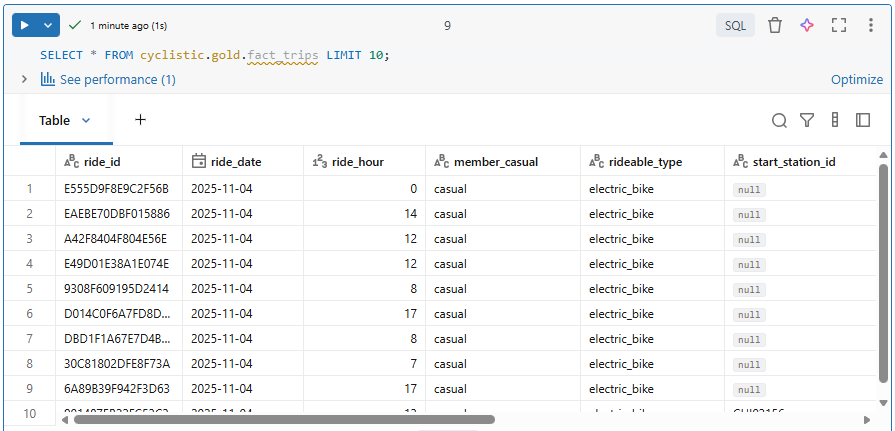
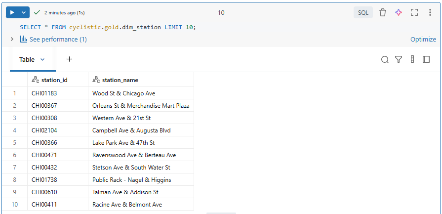
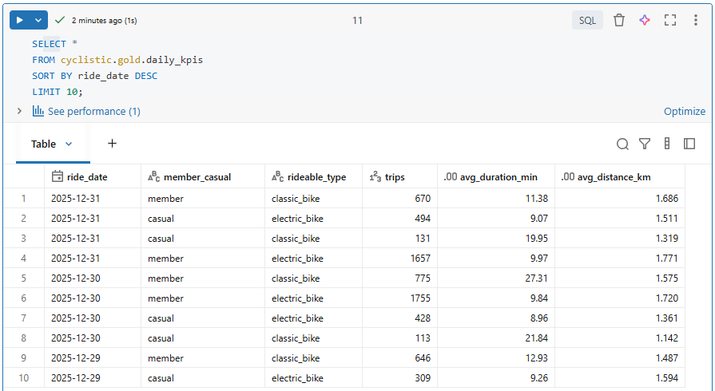
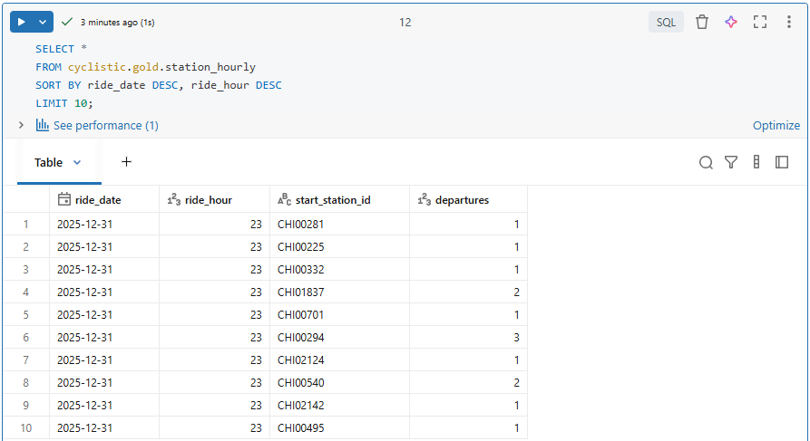

## 🥇 Build the Gold Layer

The Gold layer is where we will store the modeled data that is optimized for analytics and reporting. This layer typically contains fact and dimension tables, as well as pre-aggregated tables for common queries. 

In this project, we will create a fact table for the trips and a dimension table for the stations. We will also create some pre-aggregated tables to support common queries and KPIs.


### 1️⃣ Create the Fact Table

The fact table is designed to support analytics on bike trips, allowing us to analyze patterns and trends in bike usage across different user types, bike types, and time periods. 

We create the fact table `fact_trips` using CTAS (Create Table As Select) to select data from the Silver layer (`trips_clean`) and store it in a new Delta table in the Gold layer. We also partition the table by `ride_date` to optimize query performance for time-based analyses, which are common in this use case. Finally, we apply `ZORDER` to further optimize query performance for common filter columns.

```sql
USE CATALOG cyclistic;
USE SCHEMA gold;

CREATE TABLE IF NOT EXISTS fact_trips
USING DELTA
PARTITIONED BY (ride_date)
AS
SELECT
  ride_id, 
  ride_date, 
  ride_hour, 
  member_casual, 
  rideable_type, 
  start_station_id, 
  end_station_id,
  duration_sec, 
  duration_min, 
  distance_km, 
  is_self_loop
FROM cyclistic.silver.trips_clean;

OPTIMIZE fact_trips ZORDER BY (member_casual, rideable_type);
```

#### ✨ PySpark Alternative

```python
from pyspark.sql.functions import *

# Read the trips_clean data from the Silver layer
df_silver = (spark.read.table("cyclistic.silver.trips_clean"))
```

```python
# Transform
df_fact_trips = (
    df_silver
      .select(
          "ride_id",
          "ride_date",
          "ride_hour",
          "member_casual",
          "rideable_type",
          "start_station_id",
          "end_station_id",
          "duration_sec",
          "duration_min",
          "distance_km",
          "is_self_loop"
      )
)

# Write
(
    df_fact_trips.write
                 .format("delta")
                 .mode("overwrite")
                 .partitionBy("ride_date")
                 .saveAsTable("cyclistic.gold.fact_trips")
)
```

```python
# Optimize the fact_trips table for query performance
spark.sql("OPTIMIZE cyclistic.gold.fact_trips ZORDER BY (member_casual, rideable_type)")
```

### 2️⃣ Create the Dimension Table

The dimension table is designed to provide descriptive information about the stations, allowing us to analyze bike usage patterns based on station locations and names.

We create the dimension table `dim_station` by selecting distinct station IDs and names from the Silver layer (`trips_clean`). We use `COALESCE` to handle cases where a station may only appear as a start or end station, ensuring that we capture all unique stations in our dimension table.

```sql
CREATE OR REPLACE TABLE dim_station AS
SELECT DISTINCT
  COALESCE(start_station_id, end_station_id) AS station_id,
  COALESCE(start_station_name, end_station_name) AS station_name
FROM cyclistic.silver.trips_clean
WHERE COALESCE(start_station_id, end_station_id) IS NOT NULL;
```

#### ✨ PySpark Alternative

```python
# Transform the trips_clean data to create the dim_station dimension table
df_dim_station = (
    df_silver
        
        # Select distinct station_id and station_name pairs using COALESCE to handle nulls
        .select(
            coalesce(col("start_station_id"), col("end_station_id")).alias("station_id"),
            coalesce(col("start_station_name"), col("end_station_name")).alias("station_name")
        )
        
        # Filter out rows where station_id is null
        .filter(col("station_id").isNotNull())

        # Get distinct station_id and station_name pairs
        .distinct()
)

# Write the dimension table to the Gold layer
(
    df_dim_station.write
                  .format("delta")
                  .mode("overwrite")
                  .saveAsTable("cyclistic.gold.dim_station")
)
```

### 3️⃣ Create the KPIs and Metrics

 We create the `daily_kpis` table to store key performance indicators (KPIs) such as the number of trips, average duration, and average distance, aggregated by `ride_date`, `member_casual`, and `rideable_type`. This pre-aggregated table will allow us to quickly analyze trends and patterns in bike usage across different user types and bike types over time.

```sql
CREATE OR REPLACE TABLE daily_kpis AS
SELECT
  ride_date,
  member_casual,
  rideable_type,
  COUNT(*)                      AS trips,
  ROUND(AVG(duration_min),2)    AS avg_duration_min,
  ROUND(AVG(distance_km),3)     AS avg_distance_km
FROM cyclistic.silver.trips_clean
GROUP BY ride_date, member_casual, rideable_type;
```

#### ✨ PySpark Alternative

```python
# Transform the trips_clean data to create the daily_kpis table
df_daily_kpis = (
    df_silver
        
        # Group the data by these columns to calculate KPIs
        .groupBy(
            "ride_date",
            "member_casual",
            "rideable_type"
        )

        # Calculate KPIs: number of trips, average duration, and average distance
        .agg(
            count("*").alias("trips"),
            round(avg("duration_min"), 2).alias("avg_duration_min"),
            round(avg("distance_km"), 3).alias("avg_distance_km")
        )
)

# Write the daily_kpis table to the Gold layer
(
    df_daily_kpis.write
                 .format("delta")
                 .mode("overwrite")
                 .saveAsTable("cyclistic.gold.daily_kpis")
)
```

### 4️⃣ Create the Station-Hourly Table

We create the `station_hourly` table to analyze the number of departures from each station on an hourly basis. This will help us understand station-level usage patterns and identify peak hours for bike departures.

```sql
CREATE OR REPLACE TABLE station_hourly AS
SELECT
  ride_date,
  ride_hour,
  start_station_id,
  COUNT(*) AS departures
FROM cyclistic.silver.trips_clean
GROUP BY ride_date, ride_hour, start_station_id;

OPTIMIZE daily_kpis ZORDER BY (ride_date);
```

#### ✨ PySpark Alternative

```python

df_station_hourly = (
    df_silver
        
        # Group the data by these columns to calculate the number of departures
        .groupBy(
            "ride_date",
            "ride_hour",
            "start_station_id"
        )
        
        # Calculate the number of departures from each station on an hourly basis
        .agg(
            count("*").alias("departures")
        )
)

# Write the station_hourly table to the Gold layer
(
    df_station_hourly.write
                     .format("delta")
                     .mode("overwrite")
                     .saveAsTable("cyclistic.gold.station_hourly")
)
```

```python
# Optimize the daily_kpis table for query performance
spark.sql("OPTIMIZE cyclistic.gold.daily_kpis ZORDER BY (ride_date)")
```


### 5️⃣ Check the Gold Layer Tables

The `fact_trips` table



The `dim_station` table



The `daily_kpis` table



The `station_hourly` table



We have successfully built the Landing, Bronze, Silver, and Gold layers of our Medallion Architecture on Databricks! Next we will explore the data and create some visualizations to gain insights from the data.

---